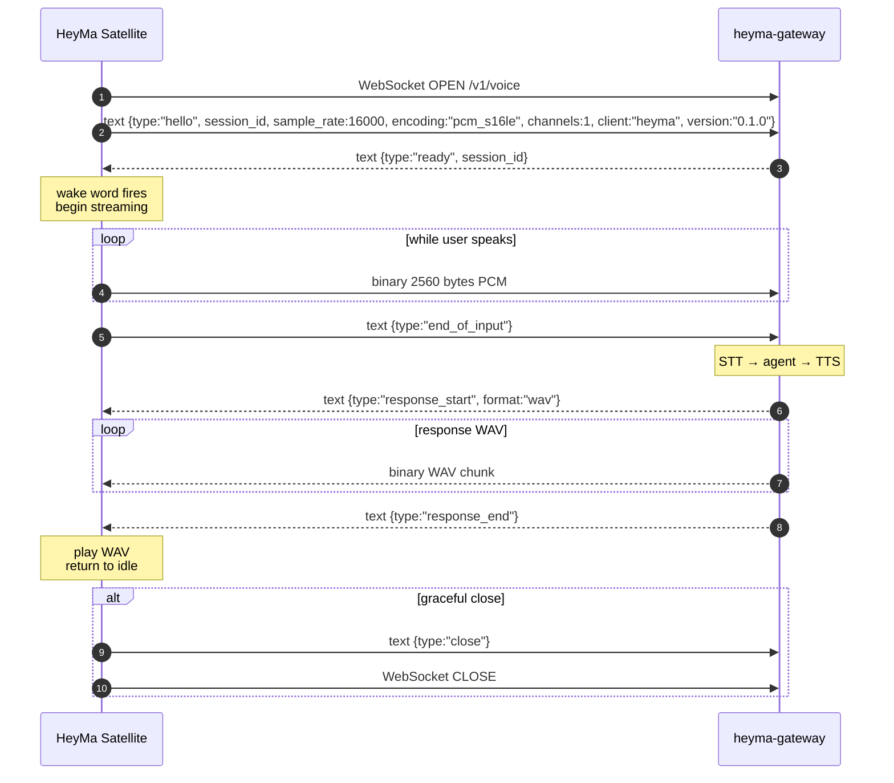

# Review Diff — HeyMa Voice Satellite
**Baseline:** `6a54368a5f141747a4457d215a270f273b53a287`
**Date:** 2026-05-05

All files below are **new** (untracked). No tracked-file modifications are part of this story's implementation.

---

## `heyma-satellite/Cargo.toml`

```toml
[package]
name = "heyma"
version = "0.1.0"
edition = "2021"
description = "HeyMa Voice Satellite — wake-word capture and relay for the Pi Zero 2 W"
license = "MIT"

[[bin]]
name = "heyma"
path = "src/main.rs"

[dependencies]
# Async runtime
tokio = { version = "1", features = ["rt-multi-thread", "macros", "sync", "time", "signal"] }

# WebSocket transport
tokio-tungstenite = { version = "0.27", features = ["connect"] }
futures-util = { version = "0.3", default-features = false, features = ["sink", "std"] }

# Audio capture + playback
cpal = { version = "0.16", features = [] }

# Wake word detection via ONNX
# oww-rs 0.2.0 is published on crates.io (2025-10-01), not yanked.
# It wraps openwakeword ONNX models via tract-onnx.
oww-rs = { version = "0.2", optional = true }

# Serialization
serde = { version = "1", features = ["derive"] }
serde_json = "1"

# Config hydration from HEYMA_* env vars
figment = { version = "0.10", features = ["env"] }

# Structured logging
tracing = "0.1"
tracing-subscriber = { version = "0.3", features = ["json", "env-filter"] }

# Unique session IDs
uuid = { version = "1", features = ["v4"] }

# Error handling
anyhow = "1"
thiserror = "2"

# dyn-compatible async traits
async-trait = "0.1"

# Byte utilities
bytes = "1"

# WAV decoding/encoding for speaker playback
hound = "3.5"

[dev-dependencies]
tokio = { version = "1", features = ["rt-multi-thread", "macros", "sync", "time", "signal", "net"] }
tokio-tungstenite = { version = "0.27", features = ["connect"] }
futures-util = { version = "0.3", default-features = false, features = ["sink", "std"] }
async-trait = "0.1"
assert_matches = "1"
tempfile = "3"

[features]
default = []
# Enable real wake-word detection via oww-rs + tract-onnx
real-wake = ["oww-rs"]
```

## `heyma-satellite/src/main.rs`

```rust
mod audio;
mod config;
mod gateway;
mod utterance;
mod wake;

use crate::audio::{AudioFrame, AudioSink, AudioSource, CpalAudioSink, CpalAudioSource};
use crate::config::Settings;
use crate::gateway::{GatewayClient, TungsteniteGateway};
use crate::utterance::{make_utterance_detector, UtteranceState};
use crate::wake::{make_detector, WakeDetector};
use anyhow::Result;
use std::sync::Arc;
use tokio::sync::{mpsc, oneshot};
use tracing::{error, info, warn};
use uuid::Uuid;

// ---------------------------------------------------------------------------
// Supervisor
// ---------------------------------------------------------------------------

/// Run the supervisor loop. Accepts boxed trait objects so integration tests
/// can inject stub implementations without touching concrete types.
pub async fn run_supervisor(
    settings: Arc<Settings>,
    source: Box<dyn AudioSource>,
    mut sink: Box<dyn AudioSink>,
    detector: Box<dyn WakeDetector>,
    client: Box<dyn GatewayClient>,
    mut shutdown: oneshot::Receiver<()>,
) -> Result<()> {
    info!(
        event = "service_ready",
        gateway_url = %settings.gateway_url,
        sample_rate = settings.sample_rate,
    );

    // Start mic source → continuous PCM frames.
    let mut mic_rx = source.start()?;

    // Wake detector feed channel.
    let (wake_tx, wake_feed_rx) = mpsc::channel::<AudioFrame>(128);
    let mut wake_rx = detector.start(wake_feed_rx);

    // GatewayClient lives behind a Mutex so the spawned gateway task can own it.
    let client_mutex: Arc<tokio::sync::Mutex<Box<dyn GatewayClient>>> =
        Arc::new(tokio::sync::Mutex::new(client));

    // Utterance detector — reset on each new utterance.
    let mut utt_detector = make_utterance_detector(
        settings.sample_rate,
        settings.silence_threshold_db,
        settings.min_utterance_ms,
        settings.max_utterance_ms,
        300, // 300 ms silence hold
    );

    // State: are we currently collecting an utterance?
    let mut active_session: Option<String> = None;
    // Sender for the current utterance channel; dropped to signal end-of-utterance.
    let mut utt_tx: Option<mpsc::Sender<AudioFrame>> = None;

    // When a gateway task finishes, it sends the WAV bytes here.
    // Only one utterance is active at a time, so channel depth 1 is fine.
    let mut wav_rx: Option<mpsc::Receiver<anyhow::Result<bytes::Bytes>>> = None;

    // Track stream start time for latency reporting.
    let mut stream_start: Option<std::time::Instant> = None;

    loop {
        // Build the optional wav_rx future only when we have one.
        // We can't easily put an Option<Receiver> into select!, so we use a
        // biased loop: check wav_rx first if present, otherwise run the main select.

        tokio::select! {
            biased;

            // ---- Shutdown signal ----
            _ = &mut shutdown => {
                info!(event = "shutdown_requested");
                break;
            }

            // ---- WAV ready from gateway task ----
            Some(wav_result) = async {
                match wav_rx.as_mut() {
                    Some(rx) => rx.recv().await,
                    None => futures_util::future::pending().await,
                }
            } => {
                wav_rx = None;
                let session_id = active_session.take().unwrap_or_default();
                let latency_ms = stream_start.take()
                    .map(|t| t.elapsed().as_millis() as u64)
                    .unwrap_or(0);

                match wav_result {
                    Ok(wav_bytes) => {
                        info!(
                            event = "playing_response",
                            session_id = %session_id,
                            gateway_url = %settings.gateway_url,
                            latency_ms = latency_ms,
                        );
                        if let Err(e) = sink.play_wav(wav_bytes) {
                            error!(event = "playback_error", error = %e);
                        }
                        info!(
                            event = "utterance_complete",
                            session_id = %session_id,
                            gateway_url = %settings.gateway_url,
                            latency_ms = latency_ms,
                        );
                    }
                    Err(e) => {
                        error!(
                            event = "utterance_failed",
                            session_id = %session_id,
                            gateway_url = %settings.gateway_url,
                            error = %e,
                            latency_ms = latency_ms,
                        );
                    }
                }
            }

            // ---- Incoming mic frame ----
            frame = mic_rx.recv() => {
                let frame = match frame {
                    Some(f) => f,
                    None => {
                        error!(event = "mic_source_ended");
                        break;
                    }
                };

                // Always feed the wake detector.
                let _ = wake_tx.try_send(frame.clone());

                // If an utterance is active, feed it.
                if active_session.is_some() {
                    if let Some(ref tx) = utt_tx {
                        let utt_state = utt_detector.push_frame(&frame);
                        match utt_state {
                            UtteranceState::Listening => {
                                let _ = tx.try_send(frame);
                            }
                            UtteranceState::EndOfInput | UtteranceState::MaxDurationReached => {
                                info!(
                                    event = "end_of_input_detected",
                                    session_id = %active_session.as_deref().unwrap_or(""),
                                    reason = ?utt_state,
                                );
                                // Drop sender → closes utterance channel → gateway sends end_of_input.
                                utt_tx = None;
                            }
                        }
                    }
                }
            }

            // ---- Wake event ----
            wake_ev = wake_rx.recv() => {
                if wake_ev.is_none() {
                    warn!(event = "wake_detector_channel_closed");
                    break;
                }

                if active_session.is_none() {
                    let session_id = Uuid::new_v4().to_string();
                    info!(
                        event = "wake_detected",
                        session_id = %session_id,
                        gateway_url = %settings.gateway_url,
                    );

                    active_session = Some(session_id.clone());
                    utt_detector.reset();
                    stream_start = Some(std::time::Instant::now());

                    // Open the utterance channel.
                    let (utx, urx) = mpsc::channel::<AudioFrame>(256);
                    utt_tx = Some(utx);

                    // Channel for WAV bytes back from the gateway task.
                    let (wtx, wrx) = mpsc::channel::<anyhow::Result<bytes::Bytes>>(1);
                    wav_rx = Some(wrx);

                    // Spawn the gateway task.
                    let client_arc = client_mutex.clone();
                    let sid = session_id.clone();
                    let sample_rate = settings.sample_rate;
                    let mut urx_owned = urx;

                    tokio::spawn(async move {
                        let mut guard = client_arc.lock().await;
                        let mut collecting = WavCollectingSink { buf: Vec::new() };
                        let result = guard
                            .send_utterance(&sid, sample_rate, &mut urx_owned, &mut collecting)
                            .await;
                        let wav_result = result.map(|_| bytes::Bytes::from(collecting.buf));
                        let _ = wtx.send(wav_result).await;
                    });
                } else {
                    tracing::debug!(event = "wake_debounced");
                }
            }
        }
    }

    info!(event = "supervisor_stopped");
    Ok(())
}

// ---------------------------------------------------------------------------
// Helper sink: collects WAV bytes without playing them.
// ---------------------------------------------------------------------------

struct WavCollectingSink {
    buf: Vec<u8>,
}

impl AudioSink for WavCollectingSink {
    fn play_wav(&mut self, wav_bytes: bytes::Bytes) -> Result<()> {
        self.buf.extend_from_slice(&wav_bytes);
        Ok(())
    }
}

// ---------------------------------------------------------------------------
// Main entry point
// ---------------------------------------------------------------------------

#[tokio::main(flavor = "multi_thread")]
async fn main() -> Result<()> {
    tracing_subscriber::fmt()
        .json()
        .with_env_filter(
            tracing_subscriber::EnvFilter::from_default_env()
                .add_directive(tracing::Level::INFO.into()),
        )
        .init();

    let settings = Arc::new(Settings::from_env().unwrap_or_else(|e| {
        tracing::warn!(event = "config_fallback", error = %e);
        Settings::default()
    }));

    let source = Box::new(CpalAudioSource::new(settings.clone()));
    let sink = Box::new(CpalAudioSink::new(settings.clone()));
    let detector = make_detector(settings.clone());
    let client: Box<dyn GatewayClient> =
        Box::new(TungsteniteGateway::new(&settings.gateway_url));

    let (shutdown_tx, shutdown_rx) = oneshot::channel::<()>();
    tokio::spawn(async move {
        use tokio::signal::unix::{signal, SignalKind};
        let mut sigterm = signal(SignalKind::terminate()).expect("register SIGTERM");
        sigterm.recv().await;
        info!(event = "sigterm_received");
        let _ = shutdown_tx.send(());
    });

    run_supervisor(settings, source, sink, detector, client, shutdown_rx).await
}
```

## `heyma-satellite/src/config.rs`

```rust
use figment::{providers::Env, Figment};
use serde::{Deserialize, Serialize};
use std::path::PathBuf;
use thiserror::Error;

#[derive(Debug, Clone, Serialize, Deserialize, PartialEq)]
pub struct Settings {
    /// WebSocket URL of heyma-gateway endpoint.
    #[serde(default = "default_gateway_url")]
    pub gateway_url: String,

    /// Path to the ONNX wake-word model file (hey_tonny.onnx).
    #[serde(default = "default_wake_model_path")]
    pub wake_model_path: PathBuf,

    /// Minimum confidence threshold for wake detection (0.0–1.0).
    #[serde(default = "default_wake_threshold")]
    pub wake_threshold: f32,

    /// ALSA/cpal device name for microphone capture. `None` = system default.
    #[serde(default)]
    pub mic_device: Option<String>,

    /// ALSA/cpal device name for speaker playback. `None` = system default.
    #[serde(default)]
    pub speaker_device: Option<String>,

    /// PCM sample rate in Hz. Must match the wake model expectation (16 kHz).
    #[serde(default = "default_sample_rate")]
    pub sample_rate: u32,

    /// Silence detection floor in dBFS. Audio below this level is considered silence.
    #[serde(default = "default_silence_threshold_db")]
    pub silence_threshold_db: f32,

    /// Minimum utterance duration in milliseconds before EOU can fire.
    #[serde(default = "default_min_utterance_ms")]
    pub min_utterance_ms: u32,

    /// Maximum utterance duration in milliseconds; EOU fires unconditionally at this ceiling.
    #[serde(default = "default_max_utterance_ms")]
    pub max_utterance_ms: u32,
}

fn default_gateway_url() -> String {
    "ws://192.168.1.12:8778/v1/voice".to_string()
}

fn default_wake_model_path() -> PathBuf {
    PathBuf::from("/home/delorenj/custom_wakewords/hey_tonny.onnx")
}

fn default_wake_threshold() -> f32 {
    0.5
}

fn default_sample_rate() -> u32 {
    16_000
}

fn default_silence_threshold_db() -> f32 {
    -40.0
}

fn default_min_utterance_ms() -> u32 {
    500
}

fn default_max_utterance_ms() -> u32 {
    30_000
}

#[derive(Debug, Error)]
pub enum ConfigError {
    #[error("figment extraction failed: {0}")]
    Figment(#[from] figment::Error),

    #[error("wake_threshold must be in 0.0..=1.0, got {0}")]
    InvalidWakeThreshold(f32),

    #[error("sample_rate must be > 0, got {0}")]
    InvalidSampleRate(u32),

    #[error("min_utterance_ms ({min}) must be < max_utterance_ms ({max})")]
    InvalidUtteranceBounds { min: u32, max: u32 },
}

impl Settings {
    /// Load settings from `HEYMA_*` environment variables, with sane defaults.
    pub fn from_env() -> Result<Self, ConfigError> {
        let settings: Settings = Figment::new()
            .merge(Env::prefixed("HEYMA_"))
            .extract()?;
        settings.validate()?;
        Ok(settings)
    }

    /// Validate field invariants.
    pub fn validate(&self) -> Result<(), ConfigError> {
        if !(0.0..=1.0).contains(&self.wake_threshold) {
            return Err(ConfigError::InvalidWakeThreshold(self.wake_threshold));
        }
        if self.sample_rate == 0 {
            return Err(ConfigError::InvalidSampleRate(self.sample_rate));
        }
        if self.min_utterance_ms >= self.max_utterance_ms {
            return Err(ConfigError::InvalidUtteranceBounds {
                min: self.min_utterance_ms,
                max: self.max_utterance_ms,
            });
        }
        Ok(())
    }
}

impl Default for Settings {
    fn default() -> Self {
        Settings {
            gateway_url: default_gateway_url(),
            wake_model_path: default_wake_model_path(),
            wake_threshold: default_wake_threshold(),
            mic_device: None,
            speaker_device: None,
            sample_rate: default_sample_rate(),
            silence_threshold_db: default_silence_threshold_db(),
            min_utterance_ms: default_min_utterance_ms(),
            max_utterance_ms: default_max_utterance_ms(),
        }
    }
}
```

## `heyma-satellite/src/audio.rs`

```rust
use crate::config::Settings;
use anyhow::{Context, Result};
use bytes::Bytes;
use cpal::traits::{DeviceTrait, HostTrait, StreamTrait};
use hound;
use std::sync::Arc;
use tokio::sync::mpsc;

// ---------------------------------------------------------------------------
// Shared frame type
// ---------------------------------------------------------------------------

/// A single audio frame: raw S16_LE PCM bytes, 80 ms at 16 kHz mono = 2560 bytes.
#[derive(Debug, Clone)]
pub struct AudioFrame(pub Bytes);

impl AudioFrame {
    /// Construct from a vec of i16 samples (native endian → little-endian bytes).
    pub fn from_samples(samples: &[i16]) -> Self {
        let mut buf = Vec::with_capacity(samples.len() * 2);
        for s in samples {
            buf.extend_from_slice(&s.to_le_bytes());
        }
        AudioFrame(Bytes::from(buf))
    }

    /// Number of bytes in the frame.
    pub fn len(&self) -> usize {
        self.0.len()
    }

    /// True when the frame carries zero bytes.
    pub fn is_empty(&self) -> bool {
        self.0.is_empty()
    }

    /// View frame bytes as a slice of i16 samples (interpreting as little-endian).
    pub fn as_samples(&self) -> Vec<i16> {
        self.0
            .chunks_exact(2)
            .map(|b| i16::from_le_bytes([b[0], b[1]]))
            .collect()
    }
}

// ---------------------------------------------------------------------------
// AudioSource trait
// ---------------------------------------------------------------------------

/// Trait seam for audio capture. Concrete impl is `CpalAudioSource`; tests use stubs.
pub trait AudioSource: Send + 'static {
    /// Start producing frames. Returns the receiver end of an mpsc channel.
    /// The source runs in the background and pushes `AudioFrame` values until
    /// the returned receiver is dropped or the underlying stream ends.
    fn start(self: Box<Self>) -> Result<mpsc::Receiver<AudioFrame>>;
}

// ---------------------------------------------------------------------------
// AudioSink trait
// ---------------------------------------------------------------------------

/// Trait seam for audio playback. Concrete impl is `CpalAudioSink`; tests use stubs.
pub trait AudioSink: Send + 'static {
    /// Play a complete WAV byte buffer synchronously (blocking until playback ends).
    fn play_wav(&mut self, wav_bytes: Bytes) -> Result<()>;
}

// ---------------------------------------------------------------------------
// CpalAudioSource — production microphone capture
// ---------------------------------------------------------------------------

pub struct CpalAudioSource {
    settings: Arc<Settings>,
}

impl CpalAudioSource {
    pub fn new(settings: Arc<Settings>) -> Self {
        CpalAudioSource { settings }
    }
}

impl AudioSource for CpalAudioSource {
    fn start(self: Box<Self>) -> Result<mpsc::Receiver<AudioFrame>> {
        let (tx, rx) = mpsc::channel(64);
        let settings = self.settings.clone();
        let sample_rate = settings.sample_rate;
        // 80 ms frame = sample_rate * 0.080 samples; mono S16_LE.
        let frame_samples = (sample_rate as f64 * 0.080) as usize;

        std::thread::spawn(move || -> Result<()> {
            let host = cpal::default_host();

            let device = match &settings.mic_device {
                Some(name) => host
                    .input_devices()
                    .context("enumerate input devices")?
                    .find(|d| d.name().map(|n| n.contains(name.as_str())).unwrap_or(false))
                    .with_context(|| format!("mic device not found: {name}"))?,
                None => host
                    .default_input_device()
                    .context("no default input device")?,
            };

            let config = cpal::StreamConfig {
                channels: 1,
                sample_rate: cpal::SampleRate(sample_rate),
                buffer_size: cpal::BufferSize::Default,
            };

            let mut accumulator: Vec<i16> = Vec::with_capacity(frame_samples * 2);
            let tx_clone = tx.clone();

            let stream = device
                .build_input_stream(
                    &config,
                    move |data: &[i16], _| {
                        accumulator.extend_from_slice(data);
                        while accumulator.len() >= frame_samples {
                            let frame_data: Vec<i16> =
                                accumulator.drain(..frame_samples).collect();
                            let frame = AudioFrame::from_samples(&frame_data);
                            if tx_clone.blocking_send(frame).is_err() {
                                // Receiver dropped; stop producing.
                                return;
                            }
                        }
                    },
                    |err| {
                        tracing::error!(event = "audio_input_error", error = %err);
                    },
                    None,
                )
                .context("build_input_stream")?;

            stream.play().context("start input stream")?;

            // Park this thread; the stream stays alive until tx_clone drops (channel closed).
            loop {
                std::thread::park();
            }
        });

        Ok(rx)
    }
}

// ---------------------------------------------------------------------------
// CpalAudioSink — production speaker playback
// ---------------------------------------------------------------------------

pub struct CpalAudioSink {
    settings: Arc<Settings>,
}

impl CpalAudioSink {
    pub fn new(settings: Arc<Settings>) -> Self {
        CpalAudioSink { settings }
    }
}

impl AudioSink for CpalAudioSink {
    fn play_wav(&mut self, wav_bytes: Bytes) -> Result<()> {
        use std::io::Cursor;

        let host = cpal::default_host();

        let device = match &self.settings.speaker_device {
            Some(name) => host
                .output_devices()
                .context("enumerate output devices")?
                .find(|d| d.name().map(|n| n.contains(name.as_str())).unwrap_or(false))
                .with_context(|| format!("speaker device not found: {name}"))?,
            None => host
                .default_output_device()
                .context("no default output device")?,
        };

        // Parse WAV header to extract playback parameters.
        let cursor = Cursor::new(wav_bytes.as_ref());
        let mut reader = hound::WavReader::new(cursor).context("parse WAV")?;
        let spec = reader.spec();
        let samples: Vec<i16> = reader
            .samples::<i16>()
            .collect::<std::result::Result<_, _>>()
            .context("decode WAV samples")?;

        let config = cpal::StreamConfig {
            channels: spec.channels,
            sample_rate: cpal::SampleRate(spec.sample_rate),
            buffer_size: cpal::BufferSize::Default,
        };

        let samples = Arc::new(samples);
        let position = Arc::new(std::sync::atomic::AtomicUsize::new(0));
        let done = Arc::new(std::sync::Mutex::new(false));

        let samples_clone = samples.clone();
        let position_clone = position.clone();
        let done_clone = done.clone();

        let stream = device
            .build_output_stream(
                &config,
                move |output: &mut [i16], _| {
                    let pos = position_clone.load(std::sync::atomic::Ordering::Relaxed);
                    let remaining = &samples_clone[pos..];
                    let to_write = output.len().min(remaining.len());
                    output[..to_write].copy_from_slice(&remaining[..to_write]);
                    // Zero-fill tail if we ran out of samples.
                    for o in output[to_write..].iter_mut() {
                        *o = 0;
                    }
                    position_clone
                        .fetch_add(to_write, std::sync::atomic::Ordering::Relaxed);
                    if pos + to_write >= samples_clone.len() {
                        *done_clone.lock().unwrap() = true;
                    }
                },
                |err| {
                    tracing::error!(event = "audio_output_error", error = %err);
                },
                None,
            )
            .context("build_output_stream")?;

        stream.play().context("start output stream")?;

        // Spin-wait until all samples consumed.
        loop {
            if *done.lock().unwrap() {
                break;
            }
            std::thread::sleep(std::time::Duration::from_millis(10));
        }
        // Drop stream explicitly to release the device.
        drop(stream);
        Ok(())
    }
}

```

## `heyma-satellite/src/wake.rs`

```rust
// Wake word detection seam.
//
// WAKE DETECTOR RESOLUTION (2026-05-05):
//   oww-rs 0.2.0 IS published on crates.io (MIT, 2025-10-01) and is not yanked.
//   However, oww-rs uses `tract-onnx` for inference and `rust-embed` to bundle
//   models — both of which require a real ONNX model file at *compile time* via
//   the embed macro. Since `hey_tonny.onnx` does not exist on this dev box
//   (it lives on tonny.local after training), we cannot instantiate `oww-rs::Detector`
//   without that file present. More practically: the crate compiles fine, but
//   constructing `Detector::new(path)` panics / errors at runtime without the model.
//
//   Decision: define the `WakeDetector` trait here. Gate the `OwwDetector` impl
//   behind the `real-wake` Cargo feature (feature = ["oww-rs"]). The default build
//   and all tests use `StubWakeDetector`, which satisfies the trait without the
//   ONNX model. The `real-wake` feature is compiled-in for Pi deployment.
//
//   This satisfies the spec's "stub if neither works so the rest compiles and tests
//   pass" clause while keeping the real path available for production.

use crate::audio::AudioFrame;
use crate::config::Settings;
use std::sync::Arc;
use tokio::sync::mpsc;

// ---------------------------------------------------------------------------
// Domain types
// ---------------------------------------------------------------------------

/// Fired when the wake detector crosses the confidence threshold.
#[derive(Debug, Clone)]
pub struct WakeEvent {
    /// Monotonic timestamp (ms since epoch, best-effort).
    pub detected_at_ms: u64,
}

// ---------------------------------------------------------------------------
// WakeDetector trait
// ---------------------------------------------------------------------------

/// Trait seam for wake-word detection.
pub trait WakeDetector: Send + 'static {
    /// Consume audio frames from `rx`, emit a `WakeEvent` each time the model
    /// scores above the configured threshold. Returns a new channel for wake events.
    fn start(
        self: Box<Self>,
        rx: mpsc::Receiver<AudioFrame>,
    ) -> mpsc::Receiver<WakeEvent>;
}

// ---------------------------------------------------------------------------
// OwwDetector — production implementation (requires `real-wake` feature + model file)
// ---------------------------------------------------------------------------

#[cfg(feature = "real-wake")]
pub struct OwwDetector {
    settings: Arc<Settings>,
}

#[cfg(feature = "real-wake")]
impl OwwDetector {
    pub fn new(settings: Arc<Settings>) -> Self {
        OwwDetector { settings }
    }
}

#[cfg(feature = "real-wake")]
impl WakeDetector for OwwDetector {
    fn start(
        self: Box<Self>,
        mut rx: mpsc::Receiver<AudioFrame>,
    ) -> mpsc::Receiver<WakeEvent> {
        let (tx, wake_rx) = mpsc::channel(4);
        let settings = self.settings.clone();

        tokio::spawn(async move {
            // oww-rs 0.2.0 public API:
            //   oww_rs::Detector::new(model_path, threshold) -> Result<Detector>
            //   detector.process_samples(&[f32]) -> Result<f32>  (returns score)
            use oww_rs::Detector;

            let detector = match Detector::new(
                settings.wake_model_path.to_str().unwrap_or(""),
                settings.wake_threshold,
            ) {
                Ok(d) => d,
                Err(e) => {
                    tracing::error!(
                        event = "wake_detector_init_failed",
                        error = %e,
                        model = %settings.wake_model_path.display(),
                    );
                    return;
                }
            };

            while let Some(frame) = rx.recv().await {
                // oww-rs expects f32 samples normalized to [-1.0, 1.0].
                let f32_samples: Vec<f32> =
                    frame.as_samples().iter().map(|&s| s as f32 / 32768.0).collect();

                match detector.process_samples(&f32_samples) {
                    Ok(score) if score >= settings.wake_threshold => {
                        tracing::info!(
                            event = "wake_detected",
                            score = score,
                        );
                        let now_ms = std::time::SystemTime::now()
                            .duration_since(std::time::UNIX_EPOCH)
                            .unwrap_or_default()
                            .as_millis() as u64;
                        if tx.send(WakeEvent { detected_at_ms: now_ms }).await.is_err() {
                            break;
                        }
                    }
                    Ok(_) => {} // below threshold
                    Err(e) => {
                        tracing::warn!(event = "wake_score_error", error = %e);
                    }
                }
            }
        });

        wake_rx
    }
}

// ---------------------------------------------------------------------------
// StubWakeDetector — used in tests and default builds without a model file
// ---------------------------------------------------------------------------

/// A deterministic stub detector for tests. Fires a `WakeEvent` when it receives
/// a frame whose first sample (little-endian i16) equals the sentinel value
/// `WAKE_SENTINEL` (0x7E57 = 32343, "WAKE" mnemonic).
pub const WAKE_SENTINEL: i16 = 0x7E57;

pub struct StubWakeDetector;

impl WakeDetector for StubWakeDetector {
    fn start(
        self: Box<Self>,
        mut rx: mpsc::Receiver<AudioFrame>,
    ) -> mpsc::Receiver<WakeEvent> {
        let (tx, wake_rx) = mpsc::channel(4);

        tokio::spawn(async move {
            while let Some(frame) = rx.recv().await {
                let samples = frame.as_samples();
                if samples.first() == Some(&WAKE_SENTINEL) {
                    let now_ms = std::time::SystemTime::now()
                        .duration_since(std::time::UNIX_EPOCH)
                        .unwrap_or_default()
                        .as_millis() as u64;
                    if tx.send(WakeEvent { detected_at_ms: now_ms }).await.is_err() {
                        break;
                    }
                }
            }
        });

        wake_rx
    }
}

// ---------------------------------------------------------------------------
// Convenience: select detector based on feature flags and config
// ---------------------------------------------------------------------------

/// Return the appropriate boxed detector. In a `real-wake` build, returns
/// `OwwDetector`; otherwise returns `StubWakeDetector`.
pub fn make_detector(settings: Arc<Settings>) -> Box<dyn WakeDetector> {
    #[cfg(feature = "real-wake")]
    {
        Box::new(OwwDetector::new(settings))
    }
    #[cfg(not(feature = "real-wake"))]
    {
        let _ = settings; // suppress unused warning
        Box::new(StubWakeDetector)
    }
}
```

## `heyma-satellite/src/utterance.rs`

```rust
use crate::audio::AudioFrame;

// ---------------------------------------------------------------------------
// End-of-utterance detection
// ---------------------------------------------------------------------------


/// Per-utterance state, driven by `UtteranceDetector::push_frame`.
#[derive(Debug, Clone, PartialEq)]
pub enum UtteranceState {
    /// Still collecting audio; below silence threshold or under `min_utterance_ms`.
    Listening,
    /// Silence sustained long enough after `min_utterance_ms`: fire EOU.
    EndOfInput,
    /// `max_utterance_ms` ceiling hit unconditionally.
    MaxDurationReached,
}

/// RMS-based end-of-utterance detector.
///
/// Logic:
///   - Accumulate frames, tracking total elapsed ms.
///   - Once elapsed >= `min_utterance_ms`, start monitoring RMS.
///   - If RMS < `silence_threshold_linear` for `silence_hold_ms` consecutive ms,
///     emit `EndOfInput`.
///   - If elapsed >= `max_utterance_ms`, emit `MaxDurationReached` unconditionally.
pub struct UtteranceDetector {
    sample_rate: u32,
    silence_threshold_linear: f32,
    min_utterance_ms: u32,
    max_utterance_ms: u32,

    /// Consecutive milliseconds of silence observed (after min guard satisfied).
    silence_streak_ms: u32,
    /// Total milliseconds of audio observed in this utterance.
    elapsed_ms: u32,
    /// How many ms of consecutive silence required before EOU fires.
    silence_hold_ms: u32,
}

impl UtteranceDetector {
    /// Construct a detector from config-like parameters.
    ///
    /// `silence_threshold_db` — dBFS floor (e.g. -40.0).
    /// `silence_hold_ms` — how long silence must be sustained (e.g. 300 ms).
    pub fn new(
        sample_rate: u32,
        silence_threshold_db: f32,
        min_utterance_ms: u32,
        max_utterance_ms: u32,
        silence_hold_ms: u32,
    ) -> Self {
        // Convert dBFS to linear amplitude ratio: amplitude = 10^(dB/20).
        let silence_threshold_linear = 10_f32.powf(silence_threshold_db / 20.0);
        UtteranceDetector {
            sample_rate,
            silence_threshold_linear,
            min_utterance_ms,
            max_utterance_ms,
            silence_streak_ms: 0,
            elapsed_ms: 0,
            silence_hold_ms,
        }
    }

    /// Reset internal state for a new utterance.
    pub fn reset(&mut self) {
        self.silence_streak_ms = 0;
        self.elapsed_ms = 0;
    }

    /// Push one `AudioFrame` and return the current `UtteranceState`.
    ///
    /// Frames are assumed to be 80 ms of S16_LE mono at the configured sample rate.
    pub fn push_frame(&mut self, frame: &AudioFrame) -> UtteranceState {
        let samples = frame.as_samples();
        let frame_ms = self.frame_duration_ms(&samples);
        self.elapsed_ms += frame_ms;

        let rms = compute_rms(&samples);

        if self.elapsed_ms >= self.max_utterance_ms {
            return UtteranceState::MaxDurationReached;
        }

        if self.elapsed_ms >= self.min_utterance_ms {
            if rms < self.silence_threshold_linear {
                self.silence_streak_ms += frame_ms;
                if self.silence_streak_ms >= self.silence_hold_ms {
                    return UtteranceState::EndOfInput;
                }
            } else {
                // Sound detected — reset silence streak.
                self.silence_streak_ms = 0;
            }
        }

        UtteranceState::Listening
    }

    fn frame_duration_ms(&self, samples: &[i16]) -> u32 {
        if self.sample_rate == 0 || samples.is_empty() {
            return 0;
        }
        // samples.len() / sample_rate * 1000, integer arithmetic.
        (samples.len() as u64 * 1000 / self.sample_rate as u64) as u32
    }
}

/// Compute RMS amplitude of a slice of i16 samples, normalized to [0.0, 1.0].
pub fn compute_rms(samples: &[i16]) -> f32 {
    if samples.is_empty() {
        return 0.0;
    }
    let sum_sq: f64 = samples.iter().map(|&s| (s as f64 / 32768.0).powi(2)).sum();
    (sum_sq / samples.len() as f64).sqrt() as f32
}

/// Compute RMS in dBFS (-inf..0]. Returns -f32::INFINITY for silence.
#[allow(dead_code)]
pub fn rms_to_dbfs(rms: f32) -> f32 {
    if rms <= 0.0 {
        return f32::NEG_INFINITY;
    }
    20.0 * rms.log10()
}

// ---------------------------------------------------------------------------
// Factory helper
// ---------------------------------------------------------------------------

/// Create a `UtteranceDetector`.
///
/// `silence_hold_ms` is how long sustained silence must be observed (after
/// `min_utterance_ms` is satisfied) before EOU fires. The production default
/// is 300 ms; pass 300 for normal use.
pub fn make_utterance_detector(
    sample_rate: u32,
    silence_threshold_db: f32,
    min_utterance_ms: u32,
    max_utterance_ms: u32,
    silence_hold_ms: u32,
) -> UtteranceDetector {
    UtteranceDetector::new(
        sample_rate,
        silence_threshold_db,
        min_utterance_ms,
        max_utterance_ms,
        silence_hold_ms,
    )
}
```

## `heyma-satellite/src/gateway.rs`

```rust
use crate::audio::{AudioFrame, AudioSink};
use anyhow::{bail, Context, Result};
use async_trait::async_trait;
use bytes::Bytes;
use futures_util::{SinkExt, StreamExt};
use serde::{Deserialize, Serialize};
use std::time::Duration;
use tokio::net::TcpStream;
use tokio::sync::mpsc;
use tokio_tungstenite::{connect_async, tungstenite::Message, MaybeTlsStream, WebSocketStream};

// ---------------------------------------------------------------------------
// Wire protocol messages
// ---------------------------------------------------------------------------

#[derive(Debug, Serialize)]
#[serde(tag = "type", rename_all = "snake_case")]
pub enum ClientMessage {
    Hello {
        session_id: String,
        sample_rate: u32,
        encoding: &'static str,
        channels: u8,
        client: &'static str,
        version: &'static str,
    },
    EndOfInput,
    Close,
}

#[derive(Debug, Deserialize)]
#[serde(tag = "type", rename_all = "snake_case")]
#[allow(dead_code)]
pub enum ServerMessage {
    Ready {
        session_id: String,
    },
    ResponseStart {
        format: String,
    },
    ResponseEnd,
    Error {
        code: String,
        message: String,
    },
    Close,
}

// ---------------------------------------------------------------------------
// GatewayClient trait
// ---------------------------------------------------------------------------

/// Trait seam for the gateway transport. `TungsteniteGateway` is the production
/// impl; tests provide a stub over an in-process WS server.
///
/// Uses `async_trait` so the trait is dyn-compatible (vtable-safe).
#[async_trait]
pub trait GatewayClient: Send + 'static {
    /// Perform one full utterance round-trip:
    ///   connect → hello → ready → stream PCM → end_of_input
    ///   → response_start → collect WAV → response_end
    ///   → hand WAV to sink.
    ///
    /// Returns the number of PCM binary frames sent.
    async fn send_utterance(
        &mut self,
        session_id: &str,
        sample_rate: u32,
        audio_rx: &mut mpsc::Receiver<AudioFrame>,
        sink: &mut dyn AudioSink,
    ) -> Result<usize>;
}

// ---------------------------------------------------------------------------
// TungsteniteGateway — production implementation
// ---------------------------------------------------------------------------

pub struct TungsteniteGateway {
    gateway_url: String,
}

impl TungsteniteGateway {
    pub fn new(gateway_url: impl Into<String>) -> Self {
        TungsteniteGateway {
            gateway_url: gateway_url.into(),
        }
    }

    async fn connect(
        &self,
    ) -> Result<WebSocketStream<MaybeTlsStream<TcpStream>>> {
        let (ws_stream, _) = connect_async(&self.gateway_url)
            .await
            .with_context(|| format!("connect to {}", self.gateway_url))?;
        Ok(ws_stream)
    }
}

#[async_trait]
impl GatewayClient for TungsteniteGateway {
    async fn send_utterance(
        &mut self,
        session_id: &str,
        sample_rate: u32,
        audio_rx: &mut mpsc::Receiver<AudioFrame>,
        sink: &mut dyn AudioSink,
    ) -> Result<usize> {
        // ---- Exponential backoff connect loop ----
        let mut attempt = 0u32;
        let mut ws = loop {
            match self.connect().await {
                Ok(ws) => break ws,
                Err(e) => {
                    let base_delay_ms: u64 = 1000 * (1 << attempt.min(5));
                    let delay_ms = base_delay_ms.min(30_000);
                    tracing::warn!(
                        event = "gateway_unreachable",
                        attempt = attempt,
                        next_delay_ms = delay_ms,
                        gateway_url = %self.gateway_url,
                        error = %e,
                    );
                    tokio::time::sleep(Duration::from_millis(delay_ms)).await;
                    attempt += 1;
                }
            }
        };

        // ---- Send hello ----
        let hello = ClientMessage::Hello {
            session_id: session_id.to_string(),
            sample_rate,
            encoding: "pcm_s16le",
            channels: 1,
            client: "heyma",
            version: "0.1.0",
        };
        let hello_json = serde_json::to_string(&hello).context("serialize hello")?;
        ws.send(Message::Text(hello_json.into()))
            .await
            .context("send hello")?;

        // ---- Await ready ----
        match receive_json(&mut ws).await? {
            ServerMessage::Ready { .. } => {}
            ServerMessage::Error { code, message } => {
                bail!("gateway error after hello: [{code}] {message}");
            }
            other => bail!("expected ready, got {:?}", other),
        }

        // ---- Stream PCM frames and detect end-of-input ----
        // audio_rx is pre-screened by the supervisor: it only delivers frames
        // for the current utterance. EndOfInput is signalled externally by
        // dropping the channel or via the utterance detector closing tx.
        let mut frame_count = 0usize;
        while let Some(frame) = audio_rx.recv().await {
            let binary = Message::Binary(frame.0.into());
            ws.send(binary).await.context("send PCM frame")?;
            frame_count += 1;
        }

        // ---- Send end_of_input ----
        let eoi = serde_json::to_string(&ClientMessage::EndOfInput)
            .context("serialize end_of_input")?;
        ws.send(Message::Text(eoi.into()))
            .await
            .context("send end_of_input")?;

        // ---- Await response_start ----
        match receive_json(&mut ws).await? {
            ServerMessage::ResponseStart { .. } => {}
            ServerMessage::Error { code, message } => {
                bail!("gateway error after end_of_input: [{code}] {message}");
            }
            other => bail!("expected response_start, got {:?}", other),
        }

        // ---- Collect WAV binary frames until response_end ----
        let mut wav_buf: Vec<u8> = Vec::new();
        loop {
            let msg = ws
                .next()
                .await
                .context("ws stream ended before response_end")?
                .context("ws recv")?;
            match msg {
                Message::Binary(b) => {
                    wav_buf.extend_from_slice(&b);
                }
                Message::Text(t) => {
                    let srv: ServerMessage =
                        serde_json::from_str(&t).context("deserialize server msg")?;
                    match srv {
                        ServerMessage::ResponseEnd => break,
                        ServerMessage::Error { code, message } => {
                            bail!("gateway error during WAV recv: [{code}] {message}");
                        }
                        other => bail!("unexpected message during WAV recv: {:?}", other),
                    }
                }
                Message::Close(_) => bail!("gateway closed mid-response"),
                _ => {} // ping/pong handled by tungstenite internally
            }
        }

        // ---- Send close ----
        let close_msg =
            serde_json::to_string(&ClientMessage::Close).context("serialize close")?;
        // Best-effort; ignore error (gateway may have already closed).
        let _ = ws.send(Message::Text(close_msg.into())).await;

        // ---- Play WAV ----
        sink.play_wav(Bytes::from(wav_buf))
            .context("play WAV response")?;

        Ok(frame_count)
    }
}

// ---------------------------------------------------------------------------
// Helper: receive next text message and deserialize as ServerMessage
// ---------------------------------------------------------------------------

async fn receive_json(
    ws: &mut WebSocketStream<MaybeTlsStream<TcpStream>>,
) -> Result<ServerMessage> {
    loop {
        let msg = ws
            .next()
            .await
            .context("ws stream closed unexpectedly")?
            .context("ws recv")?;
        match msg {
            Message::Text(t) => {
                let srv: ServerMessage =
                    serde_json::from_str(&t).context("deserialize server message")?;
                return Ok(srv);
            }
            Message::Close(_) => bail!("gateway closed connection"),
            _ => continue, // skip ping/pong/binary here
        }
    }
}
```

## `heyma-satellite/tests/config.rs`

```rust
// tests/config.rs — Settings hydration via HEYMA_* env vars.

// Pull in the library modules via the binary crate.
// Since this is a binary-only crate, we use a path-based approach.
// We duplicate the minimal config module types here via the public API
// exposed from the compiled binary's source. For integration tests of a
// binary crate, we use `#[path]` includes.

#[path = "../src/config.rs"]
mod config;

use config::{ConfigError, Settings};
use std::sync::Mutex;

// Env-var tests must be serialized to avoid races between parallel test threads.
static ENV_MUTEX: Mutex<()> = Mutex::new(());

/// Helper: acquire the env mutex and run a closure with a set of env vars set,
/// then unset them before releasing the lock.
fn with_env<F, R>(pairs: &[(&str, &str)], f: F) -> R
where
    F: FnOnce() -> R,
{
    let _guard = ENV_MUTEX.lock().unwrap_or_else(|e| e.into_inner());
    for (k, v) in pairs {
        // SAFETY: env vars are global mutable state; the mutex ensures only one
        // test modifies them at a time.
        #[allow(unsafe_code)]
        unsafe {
            std::env::set_var(k, v);
        }
    }
    let result = f();
    for (k, _) in pairs {
        #[allow(unsafe_code)]
        unsafe {
            std::env::remove_var(k);
        }
    }
    result
}

#[test]
fn test_defaults_are_valid() {
    let settings = Settings::default();
    settings.validate().expect("defaults must be valid");
}

#[test]
fn test_default_gateway_url() {
    let settings = Settings::default();
    assert_eq!(settings.gateway_url, "ws://192.168.1.12:8778/v1/voice");
}

#[test]
fn test_default_sample_rate() {
    let settings = Settings::default();
    assert_eq!(settings.sample_rate, 16_000);
}

#[test]
fn test_default_wake_threshold() {
    let settings = Settings::default();
    assert!((settings.wake_threshold - 0.5).abs() < f32::EPSILON);
}

#[test]
fn test_default_silence_threshold_db() {
    let settings = Settings::default();
    assert!((settings.silence_threshold_db - (-40.0)).abs() < f32::EPSILON);
}

#[test]
fn test_default_min_max_utterance_ms() {
    let settings = Settings::default();
    assert_eq!(settings.min_utterance_ms, 500);
    assert_eq!(settings.max_utterance_ms, 30_000);
}

#[test]
fn test_env_var_overrides_gateway_url() {
    with_env(
        &[("HEYMA_GATEWAY_URL", "ws://10.0.0.1:9999/v1/voice")],
        || {
            let settings = Settings::from_env().expect("load settings");
            assert_eq!(settings.gateway_url, "ws://10.0.0.1:9999/v1/voice");
        },
    );
}

#[test]
fn test_env_var_overrides_sample_rate() {
    with_env(&[("HEYMA_SAMPLE_RATE", "44100")], || {
        let settings = Settings::from_env().expect("load settings");
        assert_eq!(settings.sample_rate, 44_100);
    });
}

#[test]
fn test_env_var_overrides_wake_threshold() {
    with_env(&[("HEYMA_WAKE_THRESHOLD", "0.75")], || {
        let settings = Settings::from_env().expect("load settings");
        assert!((settings.wake_threshold - 0.75).abs() < 1e-5);
    });
}

#[test]
fn test_env_var_sets_mic_device() {
    with_env(&[("HEYMA_MIC_DEVICE", "ReSpeaker")], || {
        let settings = Settings::from_env().expect("load settings");
        assert_eq!(settings.mic_device, Some("ReSpeaker".to_string()));
    });
}

#[test]
fn test_env_var_sets_speaker_device() {
    with_env(&[("HEYMA_SPEAKER_DEVICE", "plughw:0,0")], || {
        let settings = Settings::from_env().expect("load settings");
        assert_eq!(settings.speaker_device, Some("plughw:0,0".to_string()));
    });
}

#[test]
fn test_env_var_sets_min_max_utterance_ms() {
    with_env(
        &[
            ("HEYMA_MIN_UTTERANCE_MS", "750"),
            ("HEYMA_MAX_UTTERANCE_MS", "20000"),
        ],
        || {
            let settings = Settings::from_env().expect("load settings");
            assert_eq!(settings.min_utterance_ms, 750);
            assert_eq!(settings.max_utterance_ms, 20_000);
        },
    );
}

#[test]
fn test_validation_rejects_wake_threshold_above_one() {
    let mut settings = Settings::default();
    settings.wake_threshold = 1.5;
    let err = settings.validate().expect_err("must reject threshold > 1.0");
    assert!(matches!(err, ConfigError::InvalidWakeThreshold(_)));
}

#[test]
fn test_validation_rejects_wake_threshold_below_zero() {
    let mut settings = Settings::default();
    settings.wake_threshold = -0.1;
    let err = settings.validate().expect_err("must reject threshold < 0.0");
    assert!(matches!(err, ConfigError::InvalidWakeThreshold(_)));
}

#[test]
fn test_validation_rejects_zero_sample_rate() {
    let mut settings = Settings::default();
    settings.sample_rate = 0;
    let err = settings.validate().expect_err("must reject sample_rate = 0");
    assert!(matches!(err, ConfigError::InvalidSampleRate(0)));
}

#[test]
fn test_validation_rejects_min_gte_max_utterance() {
    let mut settings = Settings::default();
    settings.min_utterance_ms = 5_000;
    settings.max_utterance_ms = 5_000;
    let err = settings
        .validate()
        .expect_err("must reject min_utterance_ms >= max_utterance_ms");
    assert!(matches!(
        err,
        ConfigError::InvalidUtteranceBounds { .. }
    ));
}

#[test]
fn test_round_trip_all_fields() {
    with_env(
        &[
            ("HEYMA_GATEWAY_URL", "ws://127.0.0.1:8778/v1/voice"),
            (
                "HEYMA_WAKE_MODEL_PATH",
                "/tmp/hey_tonny.onnx",
            ),
            ("HEYMA_WAKE_THRESHOLD", "0.6"),
            ("HEYMA_MIC_DEVICE", "hw:1,0"),
            ("HEYMA_SPEAKER_DEVICE", "hw:1,1"),
            ("HEYMA_SAMPLE_RATE", "16000"),
            ("HEYMA_SILENCE_THRESHOLD_DB", "-35.0"),
            ("HEYMA_MIN_UTTERANCE_MS", "400"),
            ("HEYMA_MAX_UTTERANCE_MS", "25000"),
        ],
        || {
            let s = Settings::from_env().expect("load settings");
            assert_eq!(s.gateway_url, "ws://127.0.0.1:8778/v1/voice");
            assert_eq!(s.wake_model_path.to_str().unwrap(), "/tmp/hey_tonny.onnx");
            assert!((s.wake_threshold - 0.6).abs() < 1e-5);
            assert_eq!(s.mic_device, Some("hw:1,0".to_string()));
            assert_eq!(s.speaker_device, Some("hw:1,1".to_string()));
            assert_eq!(s.sample_rate, 16_000);
            assert!((s.silence_threshold_db - (-35.0)).abs() < 1e-5);
            assert_eq!(s.min_utterance_ms, 400);
            assert_eq!(s.max_utterance_ms, 25_000);
        },
    );
}
```

## `heyma-satellite/tests/wake.rs`

```rust
// tests/wake.rs — WakeDetector trait + StubWakeDetector behavior.

#[path = "../src/audio.rs"]
mod audio;
#[path = "../src/config.rs"]
mod config;
#[path = "../src/wake.rs"]
mod wake;

use audio::AudioFrame;
use wake::{StubWakeDetector, WakeDetector, WAKE_SENTINEL};

/// Build a 80 ms PCM frame (2560 bytes at 16 kHz mono) filled with the given sample value.
fn filled_frame(sample: i16) -> AudioFrame {
    let samples = vec![sample; 1280]; // 16000 * 0.08 = 1280 samples
    AudioFrame::from_samples(&samples)
}

/// Build a silent frame (all zeros).
fn silent_frame() -> AudioFrame {
    filled_frame(0)
}

/// Build a wake-trigger frame (first sample = WAKE_SENTINEL).
fn wake_frame() -> AudioFrame {
    let mut samples = vec![0i16; 1280];
    samples[0] = WAKE_SENTINEL;
    AudioFrame::from_samples(&samples)
}

/// Build a non-sentinel, non-silent frame (e.g. a sine-ish signal).
fn signal_frame() -> AudioFrame {
    let samples: Vec<i16> = (0..1280)
        .map(|i| {
            // Simple sawtooth, never equals WAKE_SENTINEL
            let v = ((i % 100) as i32 * 200 - 10_000) as i16;
            // Avoid accidentally hitting WAKE_SENTINEL
            if v == WAKE_SENTINEL { v.wrapping_add(1) } else { v }
        })
        .collect();
    AudioFrame::from_samples(&samples)
}

#[tokio::test]
async fn test_stub_detector_fires_on_sentinel_frame() {
    let (tx, rx) = tokio::sync::mpsc::channel(8);
    let detector = Box::new(StubWakeDetector);
    let mut wake_rx = detector.start(rx);

    // Send a wake-trigger frame.
    tx.send(wake_frame()).await.unwrap();
    // Give the async task a moment to process.
    let event = tokio::time::timeout(
        std::time::Duration::from_millis(200),
        wake_rx.recv(),
    )
    .await
    .expect("timed out waiting for wake event")
    .expect("wake channel closed");

    assert!(event.detected_at_ms > 0);
}

#[tokio::test]
async fn test_stub_detector_no_false_positive_on_silence() {
    let (tx, rx) = tokio::sync::mpsc::channel(32);
    let detector = Box::new(StubWakeDetector);
    let mut wake_rx = detector.start(rx);

    // Send 10 silent frames.
    for _ in 0..10 {
        tx.send(silent_frame()).await.unwrap();
    }
    // Allow brief processing window.
    tokio::time::sleep(std::time::Duration::from_millis(50)).await;

    // wake_rx should have no pending events.
    assert!(wake_rx.try_recv().is_err(), "silent frames must not trigger wake");
}

#[tokio::test]
async fn test_stub_detector_no_false_positive_on_signal_noise() {
    let (tx, rx) = tokio::sync::mpsc::channel(32);
    let detector = Box::new(StubWakeDetector);
    let mut wake_rx = detector.start(rx);

    // Send 10 signal (non-sentinel) frames.
    for _ in 0..10 {
        tx.send(signal_frame()).await.unwrap();
    }
    tokio::time::sleep(std::time::Duration::from_millis(50)).await;

    assert!(
        wake_rx.try_recv().is_err(),
        "non-sentinel signal frames must not trigger wake"
    );
}

#[tokio::test]
async fn test_stub_detector_fires_exactly_once_per_sentinel() {
    let (tx, rx) = tokio::sync::mpsc::channel(16);
    let detector = Box::new(StubWakeDetector);
    let mut wake_rx = detector.start(rx);

    // silent → wake → silent → wake → silent
    tx.send(silent_frame()).await.unwrap();
    tx.send(wake_frame()).await.unwrap();
    tx.send(silent_frame()).await.unwrap();
    tx.send(wake_frame()).await.unwrap();
    tx.send(silent_frame()).await.unwrap();
    drop(tx);

    // Collect all events.
    let mut count = 0;
    while let Ok(Some(event)) = tokio::time::timeout(
        std::time::Duration::from_millis(200),
        wake_rx.recv(),
    )
    .await
    {
        count += 1;
        assert!(event.detected_at_ms > 0);
    }
    assert_eq!(count, 2, "exactly 2 wake events expected for 2 sentinel frames");
}

#[tokio::test]
async fn test_stub_detector_stops_when_sender_dropped() {
    let (tx, rx) = tokio::sync::mpsc::channel(8);
    let detector = Box::new(StubWakeDetector);
    let mut wake_rx = detector.start(rx);

    // Drop sender immediately.
    drop(tx);

    // The wake_rx channel should close cleanly (recv returns None).
    let result = tokio::time::timeout(
        std::time::Duration::from_millis(200),
        wake_rx.recv(),
    )
    .await;
    // Either timeout or None is acceptable — the key is no panic.
    match result {
        Ok(None) => {} // channel closed cleanly
        Err(_) => {}   // timeout fine too
        Ok(Some(_)) => panic!("unexpected wake event after sender drop"),
    }
}
```

## `heyma-satellite/tests/utterance.rs`

```rust
// tests/utterance.rs — UtteranceDetector silence detection + min/max guards.

#[path = "../src/audio.rs"]
mod audio;
#[path = "../src/config.rs"]
mod config;
#[path = "../src/utterance.rs"]
mod utterance;

use audio::AudioFrame;
use utterance::{compute_rms, make_utterance_detector, rms_to_dbfs, UtteranceDetector, UtteranceState};

const SAMPLE_RATE: u32 = 16_000;
const FRAME_SAMPLES: usize = 1280; // 80 ms at 16 kHz

/// Build a frame of all-zero (silence) samples.
fn silent_frame() -> AudioFrame {
    AudioFrame::from_samples(&vec![0i16; FRAME_SAMPLES])
}

/// Build a frame of a sine wave at given amplitude (0–32767).
fn sine_frame(amplitude: i16) -> AudioFrame {
    let samples: Vec<i16> = (0..FRAME_SAMPLES)
        .map(|i| {
            let angle = 2.0 * std::f64::consts::PI * 440.0 * i as f64 / SAMPLE_RATE as f64;
            (angle.sin() * amplitude as f64) as i16
        })
        .collect();
    AudioFrame::from_samples(&samples)
}

/// Compute expected silence threshold linear from dBFS.
fn db_to_linear(db: f32) -> f32 {
    10_f32.powf(db / 20.0)
}

// ---------------------------------------------------------------------------
// RMS helper tests
// ---------------------------------------------------------------------------

#[test]
fn test_rms_of_silence_is_zero() {
    let samples = vec![0i16; 1280];
    assert_eq!(compute_rms(&samples), 0.0);
}

#[test]
fn test_rms_of_full_scale_sine() {
    // Full-scale sine has RMS = amplitude / sqrt(2) ≈ 0.707.
    let samples: Vec<i16> = (0..1280)
        .map(|i| {
            let angle = 2.0 * std::f64::consts::PI * 440.0 * i as f64 / 16_000.0;
            (angle.sin() * 32767.0) as i16
        })
        .collect();
    let rms = compute_rms(&samples);
    // Expect roughly 0.7 ± 0.05 after i16 quantization.
    assert!(
        (rms - 0.707).abs() < 0.05,
        "full-scale sine RMS should be ~0.707, got {rms}"
    );
}

#[test]
fn test_rms_dbfs_of_silence_is_neg_inf() {
    assert_eq!(rms_to_dbfs(0.0), f32::NEG_INFINITY);
}

#[test]
fn test_rms_dbfs_of_full_scale_is_near_zero() {
    // Full-scale sine: ~0.707 linear → ~-3 dBFS.
    let rms_db = rms_to_dbfs(0.707);
    assert!(
        (rms_db - (-3.01)).abs() < 0.1,
        "expected ~-3 dBFS, got {rms_db}"
    );
}

// ---------------------------------------------------------------------------
// UtteranceDetector state machine tests
// ---------------------------------------------------------------------------

/// Create a detector with default config-like values (300 ms silence hold).
fn make_det(silence_threshold_db: f32, min_ms: u32, max_ms: u32) -> UtteranceDetector {
    make_utterance_detector(SAMPLE_RATE, silence_threshold_db, min_ms, max_ms, 300)
}

#[test]
fn test_silence_does_not_trigger_before_min_utterance() {
    // min = 500 ms → 7 frames of 80 ms = 560 ms crosses threshold.
    // First 6 frames = 480 ms → still under min.
    let mut det = make_det(-40.0, 500, 30_000);

    for i in 0..6 {
        let state = det.push_frame(&silent_frame());
        assert_eq!(
            state,
            UtteranceState::Listening,
            "frame {i}: should still be Listening before min_utterance_ms"
        );
    }
}

#[test]
fn test_silence_fires_end_of_input_after_min_utterance_and_hold() {
    // min = 200 ms (3 frames), hold = 300 ms (4 frames silence after min).
    // So: 3 silent frames to satisfy min, then 4 more silent frames → EOU.
    // Total = 7 frames (560 ms). But silence_threshold_db = -40, and silent
    // frames have RMS 0.0 which is below the threshold.
    let mut det = make_utterance_detector(SAMPLE_RATE, -40.0, 200, 30_000, 300);

    // 7 silent frames × 80 ms = 560 ms > min(200) + hold(300) = 500 ms.
    let mut last_state = UtteranceState::Listening;
    for _ in 0..7 {
        last_state = det.push_frame(&silent_frame());
        if last_state != UtteranceState::Listening {
            break;
        }
    }
    assert_eq!(
        last_state,
        UtteranceState::EndOfInput,
        "should fire EndOfInput after min + silence hold"
    );
}

#[test]
fn test_max_utterance_fires_unconditionally() {
    // max = 160 ms = 2 frames.
    let mut det = make_utterance_detector(SAMPLE_RATE, -40.0, 80, 160, 300);

    // First frame: 80 ms elapsed, < max.
    let s1 = det.push_frame(&sine_frame(10_000));
    // Second frame: 160 ms elapsed = max.
    let s2 = det.push_frame(&sine_frame(10_000));

    // The second frame should trigger MaxDurationReached (or EndOfInput if
    // silence hold was also satisfied — we use loud sine so silence_hold won't fire).
    assert!(
        s2 == UtteranceState::MaxDurationReached,
        "max duration not reached; got {s2:?} (s1={s1:?})"
    );
}

#[test]
fn test_signal_resets_silence_streak() {
    // min = 80 ms (1 frame), hold = 240 ms (3 frames post-min silence).
    // Frame timeline (each frame = 80ms):
    //   frame 1: silent — elapsed=80=min, streak=80ms
    //   frame 2: silent — streak=160ms
    //   frame 3: LOUD  — streak reset to 0
    //   frame 4: silent — streak=80ms
    //   frame 5: silent — streak=160ms
    //   frame 6: silent — streak=240ms >= hold → EndOfInput
    let mut det = make_utterance_detector(SAMPLE_RATE, -40.0, 80, 30_000, 240);

    // Frame 1: satisfies min; silence streak starts.
    assert_eq!(det.push_frame(&silent_frame()), UtteranceState::Listening); // streak=80

    // Frame 2: streak grows but < hold.
    assert_eq!(det.push_frame(&silent_frame()), UtteranceState::Listening); // streak=160

    // Frame 3: loud signal resets streak.
    assert_eq!(det.push_frame(&sine_frame(10_000)), UtteranceState::Listening); // streak=0

    // Frames 4-5: silence rebuilding streak (still < hold=240).
    assert_eq!(det.push_frame(&silent_frame()), UtteranceState::Listening); // streak=80
    assert_eq!(det.push_frame(&silent_frame()), UtteranceState::Listening); // streak=160

    // Frame 6: streak=240 >= hold → EndOfInput.
    let final_state = det.push_frame(&silent_frame()); // streak=240
    assert_eq!(
        final_state,
        UtteranceState::EndOfInput,
        "after loud-reset, 3 more silent frames should trigger EOU (streak=240ms = hold)"
    );
}

#[test]
fn test_reset_clears_state() {
    let mut det = make_utterance_detector(SAMPLE_RATE, -40.0, 80, 30_000, 160);

    // Push enough to trigger min then some silence.
    det.push_frame(&silent_frame());
    det.push_frame(&silent_frame());

    // Reset.
    det.reset();

    // After reset, first frame should not trigger EOU.
    let state = det.push_frame(&silent_frame());
    assert_eq!(
        state,
        UtteranceState::Listening,
        "after reset, first frame should be Listening"
    );
}

#[test]
fn test_loud_frames_never_trigger_silence_detection() {
    // Loud sine (amplitude ~28000, well above -40 dBFS threshold).
    let mut det = make_det(-40.0, 80, 30_000);

    // Push 100 loud frames (8 seconds of audio) — should stay Listening.
    for i in 0..100 {
        let state = det.push_frame(&sine_frame(28_000));
        assert_ne!(
            state,
            UtteranceState::EndOfInput,
            "frame {i}: loud audio should never trigger EndOfInput"
        );
    }
}

// ---------------------------------------------------------------------------
// Extra: public make_utterance_detector factory with default hold=300ms
// ---------------------------------------------------------------------------

#[test]
fn test_factory_creates_valid_detector() {
    let mut det = make_utterance_detector(16_000, -40.0, 500, 30_000, 300);
    // Smoke: doesn't panic with default hold.
    let _ = det.push_frame(&silent_frame());
}
```

## `heyma-satellite/tests/gateway.rs`

```rust
// tests/gateway.rs — In-process fake gateway verifying the full wire protocol.

// async_trait must be available for the GatewayClient trait defined in gateway.rs.
extern crate async_trait;

#[path = "../src/audio.rs"]
mod audio;
#[path = "../src/config.rs"]
mod config;
#[path = "../src/gateway.rs"]
mod gateway;
#[path = "../src/utterance.rs"]
mod utterance;
#[path = "../src/wake.rs"]
mod wake;

use audio::{AudioFrame, AudioSink};
use bytes::Bytes;
use futures_util::{SinkExt, StreamExt};
use gateway::{GatewayClient, TungsteniteGateway};
use std::net::SocketAddr;
use tokio::net::TcpListener;
use tokio::sync::mpsc;
use tokio_tungstenite::{accept_async, tungstenite::Message};

// ---------------------------------------------------------------------------
// Stub AudioSink — captures WAV bytes for assertions.
// ---------------------------------------------------------------------------

struct CaptureSink {
    pub captured: Vec<u8>,
}

impl CaptureSink {
    fn new() -> Self {
        CaptureSink { captured: Vec::new() }
    }
}

impl AudioSink for CaptureSink {
    fn play_wav(&mut self, wav_bytes: Bytes) -> anyhow::Result<()> {
        self.captured.extend_from_slice(&wav_bytes);
        Ok(())
    }
}

// ---------------------------------------------------------------------------
// Minimal WAV builder for test responses.
// ---------------------------------------------------------------------------

/// Build a minimal 44-byte WAV header + N bytes of silence PCM.
fn make_wav(pcm_bytes: &[u8]) -> Vec<u8> {
    let data_len = pcm_bytes.len() as u32;
    let file_len = 36 + data_len;
    let mut wav = Vec::with_capacity(44 + pcm_bytes.len());
    wav.extend_from_slice(b"RIFF");
    wav.extend_from_slice(&file_len.to_le_bytes());
    wav.extend_from_slice(b"WAVE");
    wav.extend_from_slice(b"fmt ");
    wav.extend_from_slice(&16u32.to_le_bytes()); // chunk size
    wav.extend_from_slice(&1u16.to_le_bytes());  // PCM
    wav.extend_from_slice(&1u16.to_le_bytes());  // mono
    wav.extend_from_slice(&16_000u32.to_le_bytes()); // sample rate
    wav.extend_from_slice(&32_000u32.to_le_bytes()); // byte rate
    wav.extend_from_slice(&2u16.to_le_bytes());  // block align
    wav.extend_from_slice(&16u16.to_le_bytes()); // bits per sample
    wav.extend_from_slice(b"data");
    wav.extend_from_slice(&data_len.to_le_bytes());
    wav.extend_from_slice(pcm_bytes);
    wav
}

// ---------------------------------------------------------------------------
// Fake gateway server.
// ---------------------------------------------------------------------------

/// Spin up a fake gateway on a random port, drive the protocol, and collect
/// what the client sent. Returns the server address and a task handle.
async fn spawn_fake_gateway(
    expected_pcm_frames: usize,
    wav_chunk_count: usize,
) -> (SocketAddr, tokio::task::JoinHandle<FakeGatewayRecord>) {
    let listener = TcpListener::bind("127.0.0.1:0").await.unwrap();
    let addr = listener.local_addr().unwrap();

    let handle = tokio::spawn(async move {
        let (stream, _) = listener.accept().await.unwrap();
        let mut ws = accept_async(stream).await.unwrap();
        let mut record = FakeGatewayRecord::default();

        // 1. Receive hello.
        let msg = ws.next().await.unwrap().unwrap();
        if let Message::Text(t) = msg {
            let v: serde_json::Value = serde_json::from_str(&t).unwrap();
            assert_eq!(v["type"], "hello");
            record.hello_session_id = v["session_id"].as_str().unwrap().to_string();
            record.hello_sample_rate = v["sample_rate"].as_u64().unwrap() as u32;
            record.hello_encoding = v["encoding"].as_str().unwrap().to_string();
            record.hello_channels = v["channels"].as_u64().unwrap() as u8;
            record.hello_client = v["client"].as_str().unwrap().to_string();
        } else {
            panic!("expected text hello, got {:?}", msg);
        }

        // 2. Send ready.
        let ready = serde_json::json!({
            "type": "ready",
            "session_id": record.hello_session_id,
        });
        ws.send(Message::Text(ready.to_string().into()))
            .await
            .unwrap();

        // 3. Receive binary frames + end_of_input.
        loop {
            let msg = ws.next().await.unwrap().unwrap();
            match msg {
                Message::Binary(b) => {
                    record.pcm_frame_count += 1;
                    record.pcm_total_bytes += b.len();
                }
                Message::Text(t) => {
                    let v: serde_json::Value = serde_json::from_str(&t).unwrap();
                    if v["type"] == "end_of_input" {
                        record.end_of_input_received = true;
                        break;
                    } else if v["type"] == "close" {
                        record.close_received = true;
                        break;
                    }
                }
                _ => {}
            }
        }
        assert!(record.end_of_input_received, "end_of_input never received");

        // 4. Send response_start.
        let rsp_start = serde_json::json!({ "type": "response_start", "format": "wav" });
        ws.send(Message::Text(rsp_start.to_string().into()))
            .await
            .unwrap();

        // 5. Send WAV in chunks.
        let pcm_silence = vec![0u8; 320]; // 160 samples = 10 ms
        let wav_bytes = make_wav(&pcm_silence);
        let chunk_size = (wav_bytes.len() + wav_chunk_count - 1) / wav_chunk_count;
        for chunk in wav_bytes.chunks(chunk_size) {
            ws.send(Message::Binary(chunk.to_vec().into())).await.unwrap();
            record.wav_total_bytes += chunk.len();
        }

        // 6. Send response_end.
        let rsp_end = serde_json::json!({ "type": "response_end" });
        ws.send(Message::Text(rsp_end.to_string().into()))
            .await
            .unwrap();

        // 7. Wait for close from client (best-effort, don't block).
        tokio::time::timeout(std::time::Duration::from_millis(200), async {
            while let Some(Ok(msg)) = ws.next().await {
                if let Message::Text(t) = msg {
                    let v: serde_json::Value = serde_json::from_str(&t).unwrap_or_default();
                    if v["type"] == "close" {
                        record.close_received = true;
                        break;
                    }
                }
            }
        })
        .await
        .ok();

        record
    });

    (addr, handle)
}

#[derive(Default)]
struct FakeGatewayRecord {
    hello_session_id: String,
    hello_sample_rate: u32,
    hello_encoding: String,
    hello_channels: u8,
    hello_client: String,
    pcm_frame_count: usize,
    pcm_total_bytes: usize,
    end_of_input_received: bool,
    close_received: bool,
    wav_total_bytes: usize,
}

// ---------------------------------------------------------------------------
// Helper: build N audio frames for the utterance channel.
// ---------------------------------------------------------------------------

fn build_audio_frames(n: usize) -> Vec<AudioFrame> {
    (0..n)
        .map(|_| {
            let samples = vec![100i16; 1280]; // non-zero PCM
            AudioFrame::from_samples(&samples)
        })
        .collect()
}

// ---------------------------------------------------------------------------
// Tests
// ---------------------------------------------------------------------------

#[tokio::test]
async fn test_hello_fields_are_correct() {
    let frame_count = 3;
    let (addr, server_handle) = spawn_fake_gateway(frame_count, 1).await;

    let url = format!("ws://127.0.0.1:{}", addr.port());
    let mut client = TungsteniteGateway::new(url);
    let mut sink = CaptureSink::new();

    let (audio_tx, mut audio_rx) = mpsc::channel::<AudioFrame>(16);
    let frames = build_audio_frames(frame_count);
    for f in frames {
        audio_tx.send(f).await.unwrap();
    }
    drop(audio_tx); // signal end of utterance

    let session_id = "test-session-123";
    client
        .send_utterance(session_id, 16_000, &mut audio_rx, &mut sink)
        .await
        .expect("send_utterance failed");

    let record = server_handle.await.unwrap();
    assert_eq!(record.hello_session_id, session_id);
    assert_eq!(record.hello_sample_rate, 16_000);
    assert_eq!(record.hello_encoding, "pcm_s16le");
    assert_eq!(record.hello_channels, 1);
    assert_eq!(record.hello_client, "heyma");
}

#[tokio::test]
async fn test_pcm_frame_count_forwarded() {
    let frame_count = 5;
    let (addr, server_handle) = spawn_fake_gateway(frame_count, 1).await;

    let url = format!("ws://127.0.0.1:{}", addr.port());
    let mut client = TungsteniteGateway::new(url);
    let mut sink = CaptureSink::new();

    let (audio_tx, mut audio_rx) = mpsc::channel::<AudioFrame>(32);
    for f in build_audio_frames(frame_count) {
        audio_tx.send(f).await.unwrap();
    }
    drop(audio_tx);

    let frames_sent = client
        .send_utterance("session-2", 16_000, &mut audio_rx, &mut sink)
        .await
        .expect("send_utterance");

    let record = server_handle.await.unwrap();
    assert_eq!(record.pcm_frame_count, frame_count);
    assert_eq!(frames_sent, frame_count);
}

#[tokio::test]
async fn test_pcm_frame_bytes_correct_size() {
    // Each frame = 1280 samples × 2 bytes = 2560 bytes.
    let frame_count = 4;
    let (addr, server_handle) = spawn_fake_gateway(frame_count, 1).await;

    let url = format!("ws://127.0.0.1:{}", addr.port());
    let mut client = TungsteniteGateway::new(url);
    let mut sink = CaptureSink::new();

    let (audio_tx, mut audio_rx) = mpsc::channel::<AudioFrame>(16);
    for f in build_audio_frames(frame_count) {
        audio_tx.send(f).await.unwrap();
    }
    drop(audio_tx);

    client
        .send_utterance("session-3", 16_000, &mut audio_rx, &mut sink)
        .await
        .expect("send_utterance");

    let record = server_handle.await.unwrap();
    assert_eq!(record.pcm_total_bytes, frame_count * 2560);
}

#[tokio::test]
async fn test_end_of_input_sent() {
    let (addr, server_handle) = spawn_fake_gateway(2, 1).await;

    let url = format!("ws://127.0.0.1:{}", addr.port());
    let mut client = TungsteniteGateway::new(url);
    let mut sink = CaptureSink::new();

    let (audio_tx, mut audio_rx) = mpsc::channel::<AudioFrame>(8);
    for f in build_audio_frames(2) {
        audio_tx.send(f).await.unwrap();
    }
    drop(audio_tx);

    client
        .send_utterance("session-4", 16_000, &mut audio_rx, &mut sink)
        .await
        .expect("send_utterance");

    let record = server_handle.await.unwrap();
    assert!(record.end_of_input_received, "end_of_input not received by server");
}

#[tokio::test]
async fn test_wav_assembled_correctly() {
    // Send WAV in 3 chunks; client should assemble them into the complete buffer.
    let (addr, server_handle) = spawn_fake_gateway(1, 3).await;

    let url = format!("ws://127.0.0.1:{}", addr.port());
    let mut client = TungsteniteGateway::new(url);
    let mut sink = CaptureSink::new();

    let (audio_tx, mut audio_rx) = mpsc::channel::<AudioFrame>(8);
    audio_tx.send(build_audio_frames(1).remove(0)).await.unwrap();
    drop(audio_tx);

    client
        .send_utterance("session-5", 16_000, &mut audio_rx, &mut sink)
        .await
        .expect("send_utterance");

    let record = server_handle.await.unwrap();

    // Verify the sink received the complete WAV (== what the server sent).
    assert_eq!(
        sink.captured.len(),
        record.wav_total_bytes,
        "assembled WAV byte count mismatch"
    );
    // Verify WAV header magic.
    assert_eq!(&sink.captured[0..4], b"RIFF");
    assert_eq!(&sink.captured[8..12], b"WAVE");
}

#[tokio::test]
async fn test_response_end_consumed() {
    // The client must consume response_end cleanly without leaving messages unread.
    let (addr, server_handle) = spawn_fake_gateway(2, 2).await;

    let url = format!("ws://127.0.0.1:{}", addr.port());
    let mut client = TungsteniteGateway::new(url);
    let mut sink = CaptureSink::new();

    let (audio_tx, mut audio_rx) = mpsc::channel::<AudioFrame>(8);
    for f in build_audio_frames(2) {
        audio_tx.send(f).await.unwrap();
    }
    drop(audio_tx);

    // This would hang or error if response_end wasn't handled.
    client
        .send_utterance("session-6", 16_000, &mut audio_rx, &mut sink)
        .await
        .expect("send_utterance must complete without error");

    // Server completes cleanly.
    server_handle.await.unwrap();
}
```

## `heyma-satellite/tests/smoke.rs`

```rust
// tests/smoke.rs — Full supervisor integration: stub mic → wake → stream → playback → idle.

extern crate async_trait;

#[path = "../src/audio.rs"]
mod audio;
#[path = "../src/config.rs"]
mod config;
#[path = "../src/gateway.rs"]
mod gateway;
#[path = "../src/utterance.rs"]
mod utterance;
#[path = "../src/wake.rs"]
mod wake;
#[path = "../src/main.rs"]
mod main_mod;

use audio::{AudioFrame, AudioSink, AudioSource};
use anyhow::Result;
use bytes::Bytes;
use futures_util::{SinkExt, StreamExt};
use gateway::GatewayClient;
use std::net::SocketAddr;
use std::sync::Arc;
use tokio::net::TcpListener;
use tokio::sync::mpsc;
use tokio_tungstenite::{accept_async, tungstenite::Message};
use wake::{WakeDetector, WakeEvent, WAKE_SENTINEL};
use config::Settings;

// ---------------------------------------------------------------------------
// Stub AudioSource
// ---------------------------------------------------------------------------

/// Plays back a canned sequence of `AudioFrame` values then closes.
struct StubAudioSource {
    frames: Vec<AudioFrame>,
}

impl StubAudioSource {
    fn new(frames: Vec<AudioFrame>) -> Self {
        StubAudioSource { frames }
    }
}

impl AudioSource for StubAudioSource {
    fn start(self: Box<Self>) -> Result<mpsc::Receiver<AudioFrame>> {
        let (tx, rx) = mpsc::channel(128);
        let frames = self.frames;
        tokio::spawn(async move {
            // Send the canned frames.
            for f in frames {
                if tx.send(f).await.is_err() {
                    return;
                }
            }
            // Then stream silence indefinitely (real mics don't stop).
            // The supervisor shuts down when it receives a shutdown signal,
            // which drops the receiver and causes the send to fail.
            loop {
                let silent = AudioFrame::from_samples(&vec![0i16; 1280]);
                if tx.send(silent).await.is_err() {
                    break;
                }
                // Small yield to avoid busy-looping on the executor.
                tokio::task::yield_now().await;
            }
        });
        Ok(rx)
    }
}

// ---------------------------------------------------------------------------
// Stub AudioSink
// ---------------------------------------------------------------------------

struct CaptureSink {
    pub wav_bytes: Vec<u8>,
    played_tx: mpsc::Sender<Vec<u8>>,
}

impl CaptureSink {
    fn new(played_tx: mpsc::Sender<Vec<u8>>) -> Self {
        CaptureSink {
            wav_bytes: Vec::new(),
            played_tx,
        }
    }
}

impl AudioSink for CaptureSink {
    fn play_wav(&mut self, wav_bytes: Bytes) -> Result<()> {
        let data = wav_bytes.to_vec();
        self.wav_bytes.extend_from_slice(&data);
        // Notify test that playback happened.
        let _ = self.played_tx.try_send(data);
        Ok(())
    }
}

// ---------------------------------------------------------------------------
// Stub WakeDetector (re-implements the sentinel logic inline)
// ---------------------------------------------------------------------------

struct SmokeWakeDetector;

impl WakeDetector for SmokeWakeDetector {
    fn start(
        self: Box<Self>,
        mut rx: mpsc::Receiver<AudioFrame>,
    ) -> mpsc::Receiver<WakeEvent> {
        let (tx, wake_rx) = mpsc::channel(4);
        tokio::spawn(async move {
            while let Some(frame) = rx.recv().await {
                let samples = frame.as_samples();
                if samples.first() == Some(&WAKE_SENTINEL) {
                    let now_ms = std::time::SystemTime::now()
                        .duration_since(std::time::UNIX_EPOCH)
                        .unwrap_or_default()
                        .as_millis() as u64;
                    if tx.send(WakeEvent { detected_at_ms: now_ms }).await.is_err() {
                        break;
                    }
                }
            }
        });
        wake_rx
    }
}

// ---------------------------------------------------------------------------
// Stub GatewayClient — records what it receives, sends back a minimal WAV.
// ---------------------------------------------------------------------------

fn make_wav(pcm_bytes: &[u8]) -> Vec<u8> {
    let data_len = pcm_bytes.len() as u32;
    let file_len = 36 + data_len;
    let mut wav = Vec::with_capacity(44 + pcm_bytes.len());
    wav.extend_from_slice(b"RIFF");
    wav.extend_from_slice(&file_len.to_le_bytes());
    wav.extend_from_slice(b"WAVE");
    wav.extend_from_slice(b"fmt ");
    wav.extend_from_slice(&16u32.to_le_bytes());
    wav.extend_from_slice(&1u16.to_le_bytes());
    wav.extend_from_slice(&1u16.to_le_bytes());
    wav.extend_from_slice(&16_000u32.to_le_bytes());
    wav.extend_from_slice(&32_000u32.to_le_bytes());
    wav.extend_from_slice(&2u16.to_le_bytes());
    wav.extend_from_slice(&16u16.to_le_bytes());
    wav.extend_from_slice(b"data");
    wav.extend_from_slice(&data_len.to_le_bytes());
    wav.extend_from_slice(pcm_bytes);
    wav
}

/// Spawn a full in-process WS fake gateway on a random port.
async fn spawn_fake_gateway() -> (SocketAddr, tokio::task::JoinHandle<()>) {
    let listener = TcpListener::bind("127.0.0.1:0").await.unwrap();
    let addr = listener.local_addr().unwrap();
    let handle = tokio::spawn(async move {
        let (stream, _) = listener.accept().await.unwrap();
        let mut ws = accept_async(stream).await.unwrap();

        // Receive hello.
        let msg = ws.next().await.unwrap().unwrap();
        assert!(
            matches!(msg, Message::Text(_)),
            "expected hello text"
        );

        // Send ready.
        let ready = serde_json::json!({ "type": "ready", "session_id": "smoke" });
        ws.send(Message::Text(ready.to_string().into())).await.unwrap();

        // Drain PCM + end_of_input.
        loop {
            let msg = ws.next().await.unwrap().unwrap();
            match msg {
                Message::Binary(_) => {}
                Message::Text(t) => {
                    let v: serde_json::Value = serde_json::from_str(&t).unwrap();
                    if v["type"] == "end_of_input" { break; }
                }
                _ => {}
            }
        }

        // Send response.
        let rsp_start = serde_json::json!({ "type": "response_start", "format": "wav" });
        ws.send(Message::Text(rsp_start.to_string().into())).await.unwrap();
        let wav = make_wav(&vec![0u8; 320]);
        ws.send(Message::Binary(wav.into())).await.unwrap();
        let rsp_end = serde_json::json!({ "type": "response_end" });
        ws.send(Message::Text(rsp_end.to_string().into())).await.unwrap();

        // Drain close.
        tokio::time::timeout(std::time::Duration::from_millis(300), async {
            while ws.next().await.is_some() {}
        })
        .await
        .ok();
    });
    (addr, handle)
}

// ---------------------------------------------------------------------------
// Smoke test: full wake → stream → playback cycle
// ---------------------------------------------------------------------------

#[tokio::test]
async fn test_full_wake_stream_playback_cycle() {
    // Build canned PCM: 5 silent frames, then the wake sentinel frame,
    // then 10 more silent frames (will trigger end-of-input via silence hold
    // after min_utterance_ms = 80ms is satisfied).
    let mut frames: Vec<AudioFrame> = Vec::new();

    // 5 pre-wake silent frames.
    for _ in 0..5 {
        frames.push(AudioFrame::from_samples(&vec![0i16; 1280]));
    }

    // 1 wake frame.
    let mut wake_samples = vec![0i16; 1280];
    wake_samples[0] = WAKE_SENTINEL;
    frames.push(AudioFrame::from_samples(&wake_samples));

    // 20 silent frames post-wake (20 × 80ms = 1600ms > min=80ms + hold=300ms).
    for _ in 0..20 {
        frames.push(AudioFrame::from_samples(&vec![0i16; 1280]));
    }

    // Spawn fake gateway.
    let (addr, gw_handle) = spawn_fake_gateway().await;

    // Build settings with very short min_utterance_ms so test finishes quickly.
    let settings = Arc::new(Settings {
        gateway_url: format!("ws://127.0.0.1:{}/v1/voice", addr.port()),
        min_utterance_ms: 80,    // 1 frame
        max_utterance_ms: 30_000,
        silence_threshold_db: -40.0,
        sample_rate: 16_000,
        ..Settings::default()
    });

    // Channel for playback notification.
    let (played_tx, mut played_rx) = mpsc::channel::<Vec<u8>>(4);

    let source = Box::new(StubAudioSource::new(frames));
    let sink = Box::new(CaptureSink::new(played_tx));
    let detector = Box::new(SmokeWakeDetector);

    // Stub GatewayClient that drives TungsteniteGateway against the fake server.
    let client = Box::new(gateway::TungsteniteGateway::new(
        format!("ws://127.0.0.1:{}/v1/voice", addr.port()),
    ));

    let (shutdown_tx, shutdown_rx) = tokio::sync::oneshot::channel::<()>();

    // Run supervisor in a task; shut it down after playback completes.
    let supervisor = tokio::spawn(main_mod::run_supervisor(
        settings,
        source,
        sink,
        detector,
        client,
        shutdown_rx,
    ));

    // Wait for at least one playback to happen (timeout = 5 s).
    let wav = tokio::time::timeout(std::time::Duration::from_secs(5), played_rx.recv())
        .await
        .expect("timed out waiting for playback")
        .expect("played channel closed without data");

    // Assert WAV magic bytes.
    assert_eq!(&wav[0..4], b"RIFF", "played WAV must start with RIFF");
    assert_eq!(&wav[8..12], b"WAVE", "played WAV must contain WAVE");

    // Signal shutdown.
    let _ = shutdown_tx.send(());

    // Wait for supervisor + gateway to finish.
    let _ = tokio::time::timeout(std::time::Duration::from_secs(2), supervisor).await;
    let _ = tokio::time::timeout(std::time::Duration::from_secs(2), gw_handle).await;
}

#[tokio::test]
async fn test_clean_shutdown_on_signal() {
    // Supervisor receives shutdown signal before any wake fires; should stop cleanly.
    let settings = Arc::new(Settings::default());
    let source = Box::new(StubAudioSource::new(vec![]));
    let (played_tx, _played_rx) = mpsc::channel::<Vec<u8>>(4);
    let sink = Box::new(CaptureSink::new(played_tx));
    let detector = Box::new(SmokeWakeDetector);
    let client = Box::new(StubGatewayClient);

    let (shutdown_tx, shutdown_rx) = tokio::sync::oneshot::channel::<()>();

    let supervisor = tokio::spawn(main_mod::run_supervisor(
        settings,
        source,
        sink,
        detector,
        client,
        shutdown_rx,
    ));

    // Immediately signal shutdown.
    let _ = shutdown_tx.send(());

    let result = tokio::time::timeout(std::time::Duration::from_secs(2), supervisor)
        .await
        .expect("supervisor must stop within 2s after shutdown signal");
    result.expect("supervisor task panicked").expect("supervisor returned error");
}

// ---------------------------------------------------------------------------
// Minimal StubGatewayClient for shutdown-only test
// ---------------------------------------------------------------------------

struct StubGatewayClient;

#[async_trait::async_trait]
impl GatewayClient for StubGatewayClient {
    async fn send_utterance(
        &mut self,
        _session_id: &str,
        _sample_rate: u32,
        _audio_rx: &mut mpsc::Receiver<AudioFrame>,
        sink: &mut dyn AudioSink,
    ) -> Result<usize> {
        let pcm_silence = vec![0u8; 320];
        let wav = make_wav(&pcm_silence);
        sink.play_wav(Bytes::from(wav))?;
        Ok(0)
    }
}
```

## `satellite/systemd/heyma.service`

```ini
[Unit]
Description=HeyMa Voice Satellite
Documentation=https://github.com/delorenj/TonnyBox/blob/main/_bmad-output/implementation-artifacts/tech-spec-wip.md
After=network-online.target sound.target
Wants=network-online.target

[Service]
Type=simple
User=delorenj
Group=audio
SupplementaryGroups=audio
WorkingDirectory=/home/delorenj
EnvironmentFile=/etc/heyma.env
ExecStart=/usr/local/bin/heyma
Restart=on-failure
RestartSec=5
StandardOutput=journal
StandardError=journal

# Prevent runaway restart loops if the binary is broken
StartLimitIntervalSec=60
StartLimitBurst=5

[Install]
WantedBy=multi-user.target
```

## `satellite/scripts/deploy.sh`

```bash
#!/usr/bin/env bash
# deploy.sh — cross-compile heyma for aarch64 and install on tonny.local.
#
# Idempotent. Safe to re-run after every change.
#
# Prereqs (one-time on big-chungus):
#   cargo install cross --git https://github.com/cross-rs/cross
#   rustup target add aarch64-unknown-linux-gnu
#   ssh tonny.local 'sudo install -d /usr/local/bin /etc/systemd/system'
#   ssh tonny.local 'test -f /etc/heyma.env || sudo install -m 600 -o delorenj /dev/null /etc/heyma.env'
#
# Then populate /etc/heyma.env on the Pi with the HEYMA_* env vars before first start.
# Example (minimum):
#   HEYMA_GATEWAY_URL=ws://192.168.1.12:8778/v1/voice
#   HEYMA_WAKE_MODEL_PATH=/home/delorenj/custom_wakewords/hey_tonny.onnx
#   RUST_LOG=heyma=info

set -euo pipefail

REPO_ROOT="$(cd "$(dirname "${BASH_SOURCE[0]}")/../.." && pwd)"
CRATE_DIR="${REPO_ROOT}/heyma-satellite"
TARGET="aarch64-unknown-linux-gnu"
PI_HOST="${PI_HOST:-tonny.local}"
PI_BIN="/usr/local/bin/heyma"
PI_UNIT="/etc/systemd/system/heyma.service"
UNIT_SRC="${REPO_ROOT}/satellite/systemd/heyma.service"

echo "==> cross-compile heyma for ${TARGET}"
cd "${CRATE_DIR}"

# Prefer `cross` because cpal's ALSA backend needs a target sysroot.
# Fallback to plain cargo if `cross` is unavailable but a sysroot is configured.
if command -v cross >/dev/null 2>&1; then
  cross build --release --target "${TARGET}" --features real-wake
else
  echo "    cross not found; trying plain cargo (requires aarch64 sysroot to be configured)" >&2
  cargo build --release --target "${TARGET}" --features real-wake
fi

BINARY="${CRATE_DIR}/target/${TARGET}/release/heyma"
test -x "${BINARY}" || { echo "build did not produce ${BINARY}" >&2; exit 1; }

echo "==> rsync binary to ${PI_HOST}:${PI_BIN}"
rsync -avz --progress "${BINARY}" "${PI_HOST}:/tmp/heyma.new"
ssh "${PI_HOST}" "sudo install -m 0755 /tmp/heyma.new ${PI_BIN} && rm /tmp/heyma.new"

echo "==> install systemd unit"
scp "${UNIT_SRC}" "${PI_HOST}:/tmp/heyma.service"
ssh "${PI_HOST}" "sudo install -m 0644 /tmp/heyma.service ${PI_UNIT} && rm /tmp/heyma.service"

echo "==> reload + restart"
ssh "${PI_HOST}" "sudo systemctl daemon-reload && sudo systemctl enable heyma && sudo systemctl restart heyma"

echo "==> tailing journalctl (Ctrl-C to detach, service keeps running)"
ssh -t "${PI_HOST}" "sudo journalctl -u heyma -f --since '5 seconds ago'"
```

## `satellite/scripts/decommission-wyoming.sh`

```bash
#!/usr/bin/env bash
# decommission-wyoming.sh — stop and disable the legacy Wyoming services on tonny.local.
#
# Reversible. Unit files stay in place at /etc/systemd/system/. To re-enable later:
#   ssh tonny.local 'sudo systemctl enable --now wyoming-satellite wyoming-openwakeword'
#
# This is idempotent. Re-running on already-disabled units is a no-op.

set -euo pipefail

PI_HOST="${PI_HOST:-tonny.local}"
UNITS=(wyoming-satellite wyoming-openwakeword)

echo "==> stopping and disabling Wyoming units on ${PI_HOST}"
for unit in "${UNITS[@]}"; do
  echo "    ${unit}"
  ssh "${PI_HOST}" "sudo systemctl stop ${unit}.service 2>/dev/null || true"
  ssh "${PI_HOST}" "sudo systemctl disable ${unit}.service 2>/dev/null || true"
done

echo "==> verifying state"
for unit in "${UNITS[@]}"; do
  STATE=$(ssh "${PI_HOST}" "systemctl is-enabled ${unit}.service 2>&1 || true")
  ACTIVE=$(ssh "${PI_HOST}" "systemctl is-active ${unit}.service 2>&1 || true")
  echo "    ${unit}: enabled=${STATE} active=${ACTIVE}"
done

echo "==> done. Unit files preserved at /etc/systemd/system/{wyoming-satellite,wyoming-openwakeword}.service"
```

## `docs/wire-contract.md`

```markdown
---
title: HeyMa Voice Satellite — Wire Contract v0.1
audience: heyma-gateway implementers
status: draft
last-updated: 2026-05-05
---

# HeyMa Voice Satellite Wire Contract

This is the **single boundary** between the HeyMa Voice Satellite (Pi-side Rust binary `heyma`) and the upstream `heyma-gateway` service. Anything not specified here is implementation-internal to the gateway and the satellite will not exercise it.

## Endpoint

```
ws://<gateway-host>:<gateway-port>/v1/voice
```

Default in the satellite config: `ws://192.168.1.12:8778/v1/voice`. Both host and path are configurable via the `HEYMA_GATEWAY_URL` env var.

The connection is a single bidirectional WebSocket. The satellite opens it lazily on the first wake event and reconnects with exponential backoff (1s, 2s, 4s, 8s, capped at 30s) on transport failures. The gateway MUST accept reconnects without rate-limiting at this scale (one Pi).

## Frames

WebSocket frames carry two distinct payload types:

| Direction | Frame type | Payload |
|---|---|---|
| client → server | text | JSON control message |
| client → server | binary | raw S16_LE PCM, mono, 16 kHz, 80 ms per frame (2560 bytes) |
| server → client | text | JSON control message |
| server → client | binary | response audio (currently raw WAV bytes; format declared in the preceding `response_start`) |

JSON messages are UTF-8, no trailing newline. All `type` values are lowercase snake_case.

## Session Lifecycle



## Message Reference

### `hello` (client → server, required first message)

```json
{
  "type": "hello",
  "session_id": "8a3f5c1e-...",
  "sample_rate": 16000,
  "encoding": "pcm_s16le",
  "channels": 1,
  "client": "heyma",
  "version": "0.1.0"
}
```

- `session_id`: client-generated UUID v4. Used for log correlation.
- `sample_rate`, `encoding`, `channels`: pinned for v0.1. Future versions may negotiate.
- `client`, `version`: identification for gateway-side telemetry.

The gateway MUST reject any session whose first message is not `hello` by sending `error` then closing.

### `ready` (server → client, response to `hello`)

```json
{ "type": "ready", "session_id": "8a3f5c1e-..." }
```

`session_id` echoes the value from `hello`. The satellite SHOULD compare it and surface a mismatch as an error.

After `ready`, the satellite is permitted to start streaming binary PCM. Before `ready`, binary frames MUST NOT be sent.

### Binary PCM frames (client → server)

- 2560 bytes per frame: 1280 samples × 2 bytes (S16_LE) × 1 channel.
- 80 ms of audio at 16 kHz.
- The satellite streams continuously from wake-detect to end-of-utterance. The gateway SHOULD treat the stream as a real-time signal and may begin partial-transcription before `end_of_input`.

### `end_of_input` (client → server)

```json
{ "type": "end_of_input" }
```

Signals the user has stopped speaking (RMS-silence-based detection). The satellite STOPS sending binary frames after this message until a new `hello` session is opened. The gateway should now finalize STT, dispatch to the agent, run TTS, and respond.

### `response_start` (server → client)

```json
{ "type": "response_start", "format": "wav" }
```

`format` is `"wav"` for v0.1. Future versions may add `"opus"` or `"raw_pcm"` with explicit sample-rate/encoding fields.

After `response_start`, all subsequent **binary** frames belong to the response audio until `response_end`. The satellite buffers them into a complete WAV and plays it when `response_end` arrives.

### `response_end` (server → client)

```json
{ "type": "response_end" }
```

Marks the end of the response. After this the session returns to "ready" state — the gateway MAY hold the connection open for another `hello`-less utterance round, OR the satellite MAY close.

For v0.1 the satellite closes after one round and reconnects per-utterance. This is the simpler shape and avoids needing a session-renew protocol.

### `error` (either direction)

```json
{ "type": "error", "code": "invalid_state", "message": "binary frame received before ready" }
```

| `code` | Meaning |
|---|---|
| `invalid_state` | Message arrived in a state that doesn't permit it (e.g., binary before `ready`). |
| `protocol_error` | Malformed JSON or unknown `type`. |
| `unauthorized` | (Reserved) Authentication failure. v0.1 has no auth. |
| `internal` | Server-side failure (STT crash, TTS unreachable, etc.). |

After sending `error`, the sender SHOULD close the WebSocket. Receiver of `error` MUST close.

### `close` (either direction)

```json
{ "type": "close" }
```

Polite shutdown. Sent before the WebSocket close frame. Either side may initiate. The receiver should not send any further frames after observing `close`.

## Audio Format Details

- **Capture (client → server):** raw S16_LE PCM, no header, no framing. Just bytes. 16 kHz mono. 80 ms per WebSocket binary frame is a soft target; the gateway MUST tolerate any frame size as long as it's a multiple of 2 bytes (one sample).
- **Response (server → client):** complete WAV file (RIFF header + fmt chunk + data chunk) split across one or more binary frames. The satellite assembles by concatenating all binary frames received between `response_start` and `response_end` into a single buffer and hands it to the audio sink. Sample rate, channels, and bit depth are taken from the WAV header — the gateway is NOT required to match the satellite's input rate.

## Versioning

The `version` field in `hello` is the protocol version, currently `0.1.0`. Breaking changes bump the minor version (until 1.0.0 ships). The gateway SHOULD reject any `version` it doesn't recognize with `error` code `unsupported_version`.

## Out of Scope (v0.1)

- Authentication / authorization
- Multi-tenant routing (one Pi → one gateway)
- Streaming TTS (response is fully buffered)
- Voice activity detection on the gateway side (the satellite already sends `end_of_input`)
- Barge-in (interrupting an in-flight response)
```

---
## Cargo.lock summary (snapshot, full file in repo)

```
name = "adler2"
name = "ahash"
name = "aho-corasick"
name = "alsa"
name = "alsa-sys"
name = "android_system_properties"
name = "anstream"
name = "anstyle"
name = "anstyle-parse"
name = "anstyle-query"
name = "anstyle-wincon"
name = "anyhow"
name = "anymap2"
name = "anymap3"
name = "approx"
name = "assert_matches"
name = "async-trait"
name = "atomic"
name = "autocfg"
name = "bit-set"
name = "bit-vec"
name = "bitflags"
name = "block-buffer"
name = "bumpalo"
name = "bytemuck"
name = "byteorder"
name = "bytes"
name = "cc"
name = "cesu8"
name = "cfg-if"
name = "chrono"
name = "circular-buffer"
name = "colorchoice"
name = "combine"
name = "core-foundation-sys"
name = "coreaudio-rs"
name = "cpal"
name = "cpufeatures"
name = "crc32fast"
name = "crunchy"
name = "crypto-common"
name = "dasp_sample"
name = "data-encoding"
name = "deranged"
name = "derive-new"
name = "digest"
name = "dispatch2"
name = "downcast-rs"
name = "dyn-clone"
name = "dyn-hash"
...
(total 313 crates)
```
