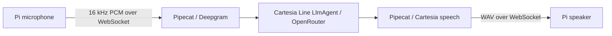

# Tonny voice walking skeleton

Tonny is a Raspberry Pi Zero 2 W with a WM8960 microphone/speaker HAT.
The Pi captures and plays audio. Speech recognition, the language model, and
speech generation run through the gateway on big-chungus.

The agent pattern comes from `james-brennan/apps/voice`: Cartesia Line's
`LlmAgent` with an OpenRouter model. This implementation has its own household
assistant prompt and provider configuration.



## Talk to it

From this repository on big-chungus:

```sh
mise run tonny:talk
```

Speak immediately after running the command. Tonny records for six seconds,
then plays the answer. Each command starts one turn. A command received during
an active turn is ignored. The server retains the last six conversation turns
in memory and forgets them after 15 minutes of inactivity or a restart.

```sh
mise run tonny:status
curl -fsS http://big-chungus.local:18778/healthz
```

`/healthz` distinguishes configured credentials from completed STT, model, and
TTS calls. The gateway cannot acknowledge physical speaker playback; the
satellite's journal reports `playback_complete` after `aplay` exits successfully.

To clear the short conversation history:

```sh
curl -fsS -X POST http://big-chungus.local:18778/v1/reset
```

## Components and configuration

| Component | Source | Runtime |
| --- | --- | --- |
| Voice gateway | `apps/voice/` | User service `tonny-voice.service` on big-chungus |
| Audio client | `apps/satellite/` | System service `tonny-satellite.service` on the Pi |
| Deployment | `deploy/tonny/`, `.mise/tasks/tonny/` | Immutable directories named for the deployed Git commit |

The server uses Python 3.12, Pipecat 1.7.0, and Cartesia Line 0.2.17.
The board uses Python 3.13, `websockets`, `arecord`, and `aplay`. It runs no
inference and uses the existing ALSA `capture` and `playback` aliases.

Nonsecret server settings are in `deploy/tonny/voice.conf`. Credentials are
1Password references in `deploy/tonny/voice.env.op`, resolved into the server
process environment by `op run`. Provider credentials never reach the Pi.
The OpenRouter reference uses the existing HeyMa key, with its existing budget.

The Pi connects to `ws://big-chungus.local:18778/v1/voice`; it uses the existing
[PCM/WAV wire contract](wire-contract.md). A captured turn stays in bounded RAM
during connection retries. Retries stop after one minute. Once audio submission
starts, a failure ends that turn instead of silently repeating an agent request.

## Check and deploy

```sh
mise run tonny:check
git add apps/voice apps/satellite deploy/tonny .mise/tasks/tonny docs/walking-skeleton.md
git commit -m "feat: run Tonny through Pipecat and Cartesia Line"
git push origin main
mise run tonny:deploy
```

Deployment requires committed component source, installs exactly that commit,
and verifies the server revision and the Pi script checksum. It starts the
gateway first, checks that the Pi can reach it, then disables `heyma.service`
and starts `tonny-satellite.service`. Both new services start automatically.
The existing Rust source and its microphone settings are available for rollback.

```sh
journalctl --user -u tonny-voice.service -n 50 --no-pager
ssh tonny 'journalctl -u tonny-satellite.service -n 30 --no-pager'
```

Manual rollback to the previous satellite:

```sh
ssh tonny 'sudo systemctl disable --now tonny-satellite.service; sudo systemctl enable --now heyma.service'
systemctl --user disable --now tonny-voice.service
```

This skeleton uses explicit push-to-talk and buffered replies. Wake-word
activation, streaming playback, barge-in, persistent memory, and household
control tools are subsequent work.

## Acceptance evidence

Live verification is in progress. A provider round trip alone does not establish
microphone intelligibility or audible physical playback.
