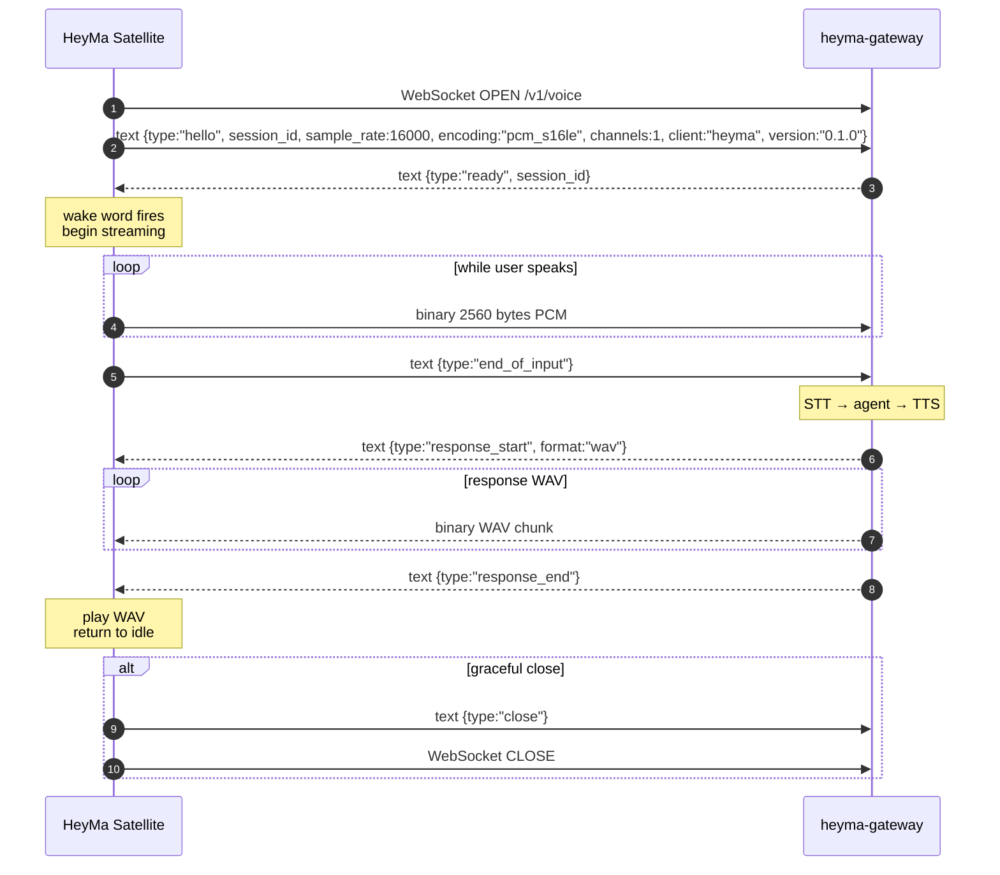

# HeyMa Voice Satellite Wire Contract

This is the **single boundary** between the HeyMa Voice Satellite (Pi-side Rust binary `heyma`) and the upstream `heyma-gateway` service. Anything not specified here is implementation-internal to the gateway and the satellite will not exercise it.

## Endpoint

```
ws://<gateway-host>:<gateway-port>/v1/voice
```

Default in the satellite config: `ws://192.168.1.12:8778/v1/voice`. Both host and path are configurable via the `HEYMA_GATEWAY_URL` env var.

The connection is a single bidirectional WebSocket. The satellite opens it fresh per utterance on each wake event (no persistent connection across utterances) and reconnects with exponential backoff (1s, 2s, 4s, 8s, 16s, capped at 30s) on transport failures, with an overall connect deadline of 60s before the satellite gives up and returns to wake-listening. The gateway MUST accept reconnects without rate-limiting at this scale (one Pi).

## Frames

WebSocket frames carry two distinct payload types:

| Direction | Frame type | Payload |
|---|---|---|
| client → server | text | JSON control message |
| client → server | binary | raw S16_LE PCM, mono, 16 kHz, 80 ms per frame (2560 bytes) |
| server → client | text | JSON control message |
| server → client | binary | response audio (currently raw WAV bytes; format declared in the preceding `response_start`) |

JSON messages are UTF-8, no trailing newline. All `type` values are lowercase snake_case.

## Session Lifecycle



## Message Reference

### `hello` (client → server, required first message)

```json
{
  "type": "hello",
  "session_id": "8a3f5c1e-...",
  "sample_rate": 16000,
  "encoding": "pcm_s16le",
  "channels": 1,
  "client": "heyma",
  "version": "0.1.0"
}
```

- `session_id`: client-generated UUID v4. Used for log correlation.
- `sample_rate`, `encoding`, `channels`: pinned for v0.1. Future versions may negotiate.
- `client`, `version`: identification for gateway-side telemetry.

The gateway MUST reject any session whose first message is not `hello` by sending `error` then closing.

### `ready` (server → client, response to `hello`)

```json
{ "type": "ready", "session_id": "8a3f5c1e-..." }
```

`session_id` echoes the value from `hello`. The satellite SHOULD compare it and surface a mismatch as an error.

After `ready`, the satellite is permitted to start streaming binary PCM. Before `ready`, binary frames MUST NOT be sent.

### Binary PCM frames (client → server)

- 2560 bytes per frame: 1280 samples × 2 bytes (S16_LE) × 1 channel.
- 80 ms of audio at 16 kHz.
- The satellite streams continuously from wake-detect to end-of-utterance. The gateway SHOULD treat the stream as a real-time signal and may begin partial-transcription before `end_of_input`.

### `end_of_input` (client → server)

```json
{ "type": "end_of_input" }
```

Signals the user has stopped speaking (RMS-silence-based detection). The satellite STOPS sending binary frames after this message until a new `hello` session is opened. The gateway should now finalize STT, dispatch to the agent, run TTS, and respond.

### `response_start` (server → client)

```json
{ "type": "response_start", "format": "wav" }
```

`format` is `"wav"` for v0.1. Future versions may add `"opus"` or `"raw_pcm"` with explicit sample-rate/encoding fields.

After `response_start`, all subsequent **binary** frames belong to the response audio until `response_end`. The satellite buffers them into a complete WAV and plays it when `response_end` arrives.

### `response_end` (server → client)

```json
{ "type": "response_end" }
```

Marks the end of the response. After this the session returns to "ready" state — the gateway MAY hold the connection open for another `hello`-less utterance round, OR the satellite MAY close.

For v0.1 the satellite closes after one round and reconnects per-utterance. This is the simpler shape and avoids needing a session-renew protocol.

### `error` (either direction)

```json
{ "type": "error", "code": "invalid_state", "message": "binary frame received before ready" }
```

| `code` | Meaning |
|---|---|
| `invalid_state` | Message arrived in a state that doesn't permit it (e.g., binary before `ready`). |
| `protocol_error` | Malformed JSON or unknown `type`. |
| `unauthorized` | (Reserved) Authentication failure. v0.1 has no auth. |
| `internal` | Server-side failure (STT crash, TTS unreachable, etc.). |

After sending `error`, the sender SHOULD close the WebSocket. Receiver of `error` MUST close.

### `close` (either direction)

```json
{ "type": "close" }
```

Polite shutdown. Sent before the WebSocket close frame. Either side may initiate. The receiver should not send any further frames after observing `close`.

## Audio Format Details

- **Capture (client → server):** raw S16_LE PCM, no header, no framing. Just bytes. 16 kHz mono. 80 ms per WebSocket binary frame is a soft target; the gateway MUST tolerate any frame size as long as it's a multiple of 2 bytes (one sample).
- **Response (server → client):** complete WAV file (RIFF header + fmt chunk + data chunk) split across one or more binary frames. The satellite assembles by concatenating all binary frames received between `response_start` and `response_end` into a single buffer and hands it to the audio sink. Sample rate, channels, and bit depth are taken from the WAV header — the gateway is NOT required to match the satellite's input rate.

## Versioning

The `version` field in `hello` is the protocol version, currently `0.1.0`. Breaking changes bump the minor version (until 1.0.0 ships). The gateway SHOULD reject any `version` it doesn't recognize with `error` code `unsupported_version`.

## Out of Scope (v0.1)

- Authentication / authorization
- Multi-tenant routing (one Pi → one gateway)
- Streaming TTS (response is fully buffered)
- Voice activity detection on the gateway side (the satellite already sends `end_of_input`)
- Barge-in (interrupting an in-flight response)
